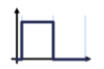
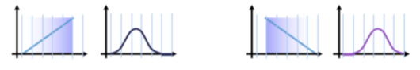
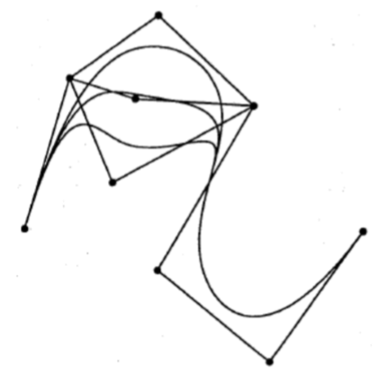
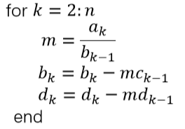
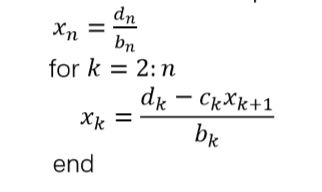

# B样条

## 1. B样条基函数

### 1.1. De Boor递推

#### 1.1.1. 单位情况

$k$阶（$k-1$度）单位B样条基函数表示为：

$$
N_i^1(t)=\begin{cases}
1,&i\leq t<i+1\\\\0,&\mathrm{otherwise}
\end{cases}
$$

$$
\begin{align}
N_i^k(t)&=\dfrac{t-i}{(i+k-1)-i}N_i^{k-1}(t)+\dfrac{(i+k)-t}{(i+k)-(i+1)}N_{i+1}^{k-1}(t)\\\\
&=\dfrac{t-i}{k-1}N_i^{k-1}(t)+\dfrac{i+k-t}{k-1}N_{i+1}^{k-1}(t)
\end{align}
$$

#### 1.1.2. 一般情况

* 给定：结序列$t_0<t_1<\cdots<t_n<\cdots<t_{n+k}$

	（$(t_0,t_1,\cdots,t_{n+k})$称为结向量）

* 归一化的$k$阶（$k-1$度）单位B样条基函数$N_{i,k}$定义为：
	
	$$
	\begin{align}
	N_i^1(t)&=\begin{cases}
	1,&t_i\leq t<t_{i+1}\\\\0,&\mathrm{otherwise}
	\end{cases}\\\\
	N_{i,k}(t)&=\dfrac{t-t_i}{t_{i+k-1}-t_i}N_{i,k-1}(t)+\dfrac{t_{i+k}-t}{t_{i+k}-t_{i+1}}N_{i+1,k-1}(t)
	
	\end{align}
	$$
	
	其中，$k>1$且$i=0,\cdots,n$

### 1.2. 核心思想

* 设计基函数$\pmb b(t)$
* 性质：
	* $\pmb b(t)$为$C^2$连续
	* $\pmb b(t)$是三次分段多项式
	* $\pmb b(t)$具有局部控制性质
	* 叠加位移的$\pmb b(t+i)$组成一个整体的划分
	* 对所有的$t$，有$\pmb b(t)\geq 0$
* 简而言之
	* 基函数中具有所有所需的性质
	* 基函数的线性组合也将有这些性质

### 1.3. 基函数性质

* 对$t_i<t<t_{i+k}$，有$N_{i,k}(t)>0$
* 对$t_0<t<t_i$或$t_{i+k}<t<t_{n+k}$，有$N_{i,k}(t)=0$
* 对$t_{k-1}\leq t\leq t_{n+1}$，有$\sum_{i=1}^nN_{i,k}(t)=1$

* 对于$t_i\leq t_j\leq t_{i+k}$，基函数$N_{i,k}(t)$在结点$t_j$处有$C^{k-2}$连续性
* 区间$[t_i,t_{i+k}]$称为$N_{i,k}$的支撑（support）

## 2. B样条曲线

### 2.1. B样条曲线简介

* 给定$n+1$个控制点$\pmb d_0,\cdots,\pmb d_n\in \mathbb R^3$，结向量$T=(t_0,\cdots,t_n,\cdots,t_{n+k})$

* $k$阶B样条曲线$\pmb x(t)$定义为：
	
	$$
	\pmb x(t)=\sum\limits_{i=0}^nN_{i,k}(t)\cdot\pmb d_i
	$$

* 点$\pmb d_i$称为de Boor points

#### 2.1.1. 重复结向量

* B样条曲线允许：$T=(t_0,\cdots,t_n,\cdots,t_{n+k})$，$t_0\leq t_1\leq \cdots\leq t_{n+k}$ 
* 只要不超过$k$个结重合，B样条函数$N_{i,k}(i=0,\cdots,n)$的递归定义依然有效

* 多结重合的效果：

	* 设：$t_0=t_1=\cdots=t_{k-1}$
	* 且$t_{n+1}=t_{n+2}=\cdots=t_{n+k}$

	则将插值$\pmb d_0$和$\pmb d_n$

### 2.2. B样条的性质

#### 2.2.1. B样条函数 vs Bernstein多项式

结向量$T=(t_0,t_1,\cdots,t_{2k-1})=(\underbrace{0,\cdots,0}_k,\underbrace{1,\cdots,1}_k)$下的$k$阶B样条函数$N_{i,k}(i=0,\cdots,k-1)$为$k-1$次Bernstein多项式$B_i^{k-1}$

#### 2.2.2. 基本性质

* 给定

	* $T=(\underbrace{t_0,\cdots,t_0}_{k\ \mathrm{times}},t_k,\cdots,t_n,\underbrace{t_{n+1},\cdots,t_{n+1}}_{k\ \mathrm{times}})$ 
	* de Boor多边形$\pmb d_0,\cdots,\pmb d_n$

* 相应的B样条曲线$\pmb x(t)$有以下性质：

	* $\pmb x(t_0)=\pmb d_0$，$\pmb x(t_{n+1})=\pmb d_n$（边界点插值）

	* $\dot{\pmb x}(t_0)=\dfrac{k-1}{t_k-t_0}(\pmb d_1-\pmb d_0)$（$\pmb d_0$处的切线方向与$\pmb d_n$处相似）

	* $\pmb x(t)$由$n-k+2$个$k-1$次多项式曲线段构成

	* 多重内部结$\Rightarrow$减小了$\pmb x(t)$的连续阶数

		$l$重内部结$(1\leq l<k)$意味着$C^{k-l-1}$阶连续

	* de Boor点的局部影响：移动$\pmb d_i$只会改变曲线的$[t_i,t_{i+k}]$区间部分

	* 插入新的de Boor点不会改变曲线段的多项式阶数

#### 2.2.3. B样条曲线的局部性

#### 2.2.4. B样条曲线的升阶

* 使用B样条函数

* 使用de Boor算法

	与Bezier曲线的de Casteljau算法类似，在Boor多边形上进行一系列的线性插值

### 2.3. de Boor算法

* 给定：

	de Boor点：$\pmb d_0,\cdots,\pmb d_n$

	结向量：$(t_0,\cdots,t_{k-1}=t_0,t_k,t_{k+1},\cdots,t_n,t_{n+1},\cdots,t_{n+k}=t_{n+1})$

* 目标：$k$结B样条曲线的曲线点$\pmb x(t)$

* 算法流程：

	

* 中间系数$\pmb d_i^j(t)$可以表示为一个下三角矩阵——de Boor图
	
	$$
	\begin{matrix}
	\pmb d_{r-k+1}=\pmb d^0_{r-k+1}\\\\
	\pmb d_{r-k+2}=\pmb d^0_{r-k+2}&\pmb d_{r-k+2}^1\\\\
	\vdots\\\\
	\pmb d_{r-1}=\pmb d_{r-1}^0&\pmb d_{r-1}^1&\cdots&\pmb d_{r-1}^{k-2}\\\\
	\pmb d_r=\pmb d_r^0&\pmb d_r^1&\cdots&\pmb d_r^{k-2}&\pmb d_r^{k-1}=\pmb x(t)
	\end{matrix}
	$$

### 2.4. B样条曲线插值

* 给定：$n+1$个控制点$\pmb k_0,\cdots,\pmb k_n$，结序列$s_0,\cdots,s_n$

* 目标：分段三次插值B样条曲线$\pmb x$

* 方法：分段三次$\Rightarrow k=4$

	* $\pmb x(t)$由$n$段组成$\Rightarrow n+3$个de Boor点

* 实例：$n=3$

	

* 若选择结向量
	
	$$
	\begin{align}
	T&=(t_0,t_1,t_2,t_3,t_4,\cdots,t_{n+2},t_{n+3},t_{n+4},t_{n+5},t_{n+6})\\\\
	&=(s_0,s_0,s_0,s_0,s_1,\cdots,s_{n-1},s_n,s_n,s_n,s_n)
	\end{align}
	$$

* 插值条件：
	
	$$
	\begin{align}
	\pmb x(s_0)&=\pmb k_0=\pmb d_0\\\\
	\pmb x(s_i)&=\pmb k_i=N_{i,4}(s_i)\pmb d_i+N_{i+1,4}(s_i)\pmb d_{i+1}+N_{i+2,4}(s_i)\pmb d_{i+2}\\\\
	&\mathrm{for}\ i=1,\cdots,n-1\\\\
	\pmb x(s_n)&=\pmb k_n=\pmb d_{n+2}
	\end{align}
	$$

* 共计：$n+1$个条件解$n+3$个未知的de Boor点

	$\Rightarrow$ 2个终值条件

* natural end condition
	
	$$
	\begin{align}
	\ddot{\pmb x}(s_0)&=0\Leftrightarrow \dfrac{\pmb d_2-\pmb d_1}{s_2-s_0}=\dfrac{\pmb d_1-\pmb d_0}{s_1-s_0}\\\\
	\ddot{\pmb x}(s_n)&=0\Leftrightarrow \dfrac{\pmb d_{n+2}-\pmb d_{n+1}}{s_n-s_{n-1}}=\dfrac{\pmb d_{n+1}-\pmb d_n}{s_n-s_{n-2}}
	\end{align}
	$$

* 结果可以表示为求解对角系统方程：
	
	$$
	\begin{pmatrix}
	1\\\\
	\alpha_0&\beta_0&\gamma_0\\\\
	&\alpha_1&\beta_1&\gamma_1\\\\
	&&&\ddots\\\\
	&&&&\alpha_{n-1}&\beta_{n-1}&\gamma_{n-1}\\\\
	&&&&&\alpha_n&\beta_n&\gamma_n\\\\
	&&&&&&&1
	\end{pmatrix}
	\begin{pmatrix}
	\pmb d_0\\\\\pmb d_1\\\\\pmb d_2\\\\\vdots\\\\\pmb d_n\\\\
	\pmb d_{n+1}\\\\\pmb d_{n+2}
	\end{pmatrix}=
	
	\begin{pmatrix}
	\pmb k_0\\\\\pmb 0\\\\\pmb k_1\\\\\vdots\\\\\pmb k_{n-1}\\\\
	\pmb 0\\\\\pmb k_{n}
	\end{pmatrix}
	$$
	
	其中，
	
	$$
	\begin{align}
	\alpha_0&=s_2-s_0\\\\
	\beta_0&=-(s_2-s_0)-(s_1-s_0)\\\\
	\gamma_0&=s_1-s_0\\\\
	\\\\
	\alpha_n&=s_n-s_{n-1}\\\\
	\beta_n&=-(s_n-s_{n-1})-(s_n-s_{n-2})\\\\
	\gamma_n&=s_n-s_{n-2}\\\\
	\\\\
	\alpha_i&=N_{i,4}(s_i)\\\\
	\beta_i&=N_{i+1,4}(s_i)\\\\
	\gamma_i&=N_{i+2,4}(s_i)\\\\
	\mathrm{for}&\ i=1,\cdots,n-1
	\end{align}
	$$

* 解法
	* 托马斯算法——解决对角系统方程
	* 复杂度$O(n)$
	* 仅适用于对角占优矩阵

	对于对角系统方程
	
	$$
	\begin{pmatrix}
	b_1&c_1&&&0\\\\
	a_2&b_2&c_2\\\\
	&a_3&b_3&\cdot&\\\\
	&&\cdot&\cdot&c_{n-1}\\\\
	0&&&a_n&b_n
	\end{pmatrix}
	\begin{pmatrix}
	x_1\\\\x_2\\\\\vdots\\\\x_n
	\end{pmatrix}=
	\begin{pmatrix}
	d_1\\\\d_2\\\\\vdots\\\\d_n
	\end{pmatrix}
	$$
	
	求解流程：

	1. 前向消除阶段

		

	2. 后向替代阶段

		

### 2.5. Bezier曲线转B样条曲线

* 给定

	控制点：$\pmb k_0,\cdots,\pmb k_n$

	结序列：$t_0,\cdots,t_n$

	2个终值条件

	$\pmb b_0,\cdots,\pmb b_{3n}$：用于$C^2$连续插值三次Bezier样条曲线的Bezier点

* 目标：一些B样条形式的曲线

* 结向量
	
	$$
	T=(t_0,t_0,t_0,t_0,t_1,\cdots,t_{n-1},t_n,t_n,t_n,t_n)
	$$

* $\pmb d_0,\cdots,\pmb d_{n+2}$由下列式子决定：
	
	$$
	\begin{align}
	\pmb d_0&=\pmb b_0\\\\
	\pmb d_1&=\pmb b_1\\\\
	\pmb d_i&=\pmb b_{3i-4}+\frac{\Delta_{i-1}}{\Delta_{i-2}}(\pmb b_{3i-4}-\pmb b_{3i-5})\ \mathrm{for}\ i=2,\cdots,n\\\\
	\pmb d_{n+1}&=\pmb b_{3n-1}\\\\
	\pmb d_{n+2}&=\pmb b_{3n}
	\end{align}
	$$
	
	其中，$\Delta_i=t_{i+1}-t_i\quad \mathrm{for}\quad i=0,\cdots,n-1$

* 逆问题同样可解

## 3. Bezier和B样条曲线小结

1. 由$n+1$个控制点$\pmb b_0,\cdots,b_n$决定的Bezier曲线
	* $n$次多项式曲线
	* 由控制点唯一确定
	* 边界点作插值，其他点作逼近
	* 控制点的伪局部影响
2. 由控制点$\pmb k_0,\cdots,\pmb k_n$插值的三次Bezier样条曲线
	* 由$n$个分段三次曲线段组成
	* 控制点处有$C^2$连续性
	* 由参数化（如结序列）和两个终值条件唯一确定
	* 插值所有控制点
	* 控制点的伪局部影响
3. 由控制点$\pmb d_0,\cdots,\pmb d_n$和结向量$T=(t_0,t_0,t_0,t_0,t_1,\cdots,t_{n-1},t_n,t_n,t_n,t_n)$得到的分段三次B样条曲线
	* 由在结点处具有$C^2$连续状态的$n-2$条分段三次曲线段组成
	* 由$\pmb d_i$和$T$唯一确定
	* 边界点插值，其余点逼近
	* de Boor点局部影响
4. 通过控制点$\pmb k_0,\cdots,k_n$插值三次B样条
	* 对每个$x,y,z$分量，可以使用2个终值条件和求解一个对角线矩阵系统方程来实现类似3.的效果
	* 与2. 的曲线相同

