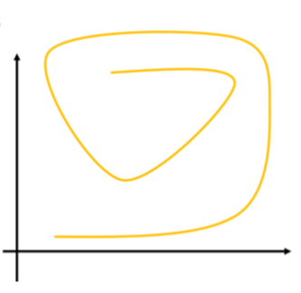
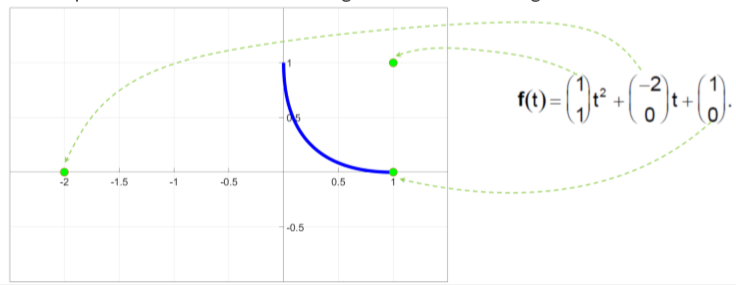
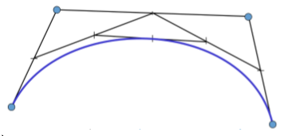
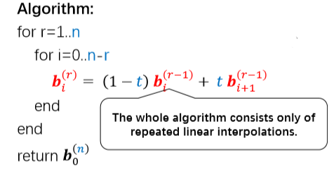
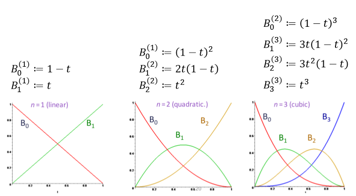
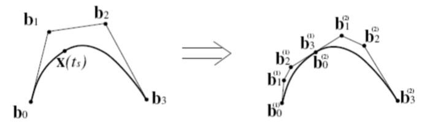

# CAGD(2) | Bezier曲线

## 1. 曲线的表示

### 1.1. 隐式表示

曲线隐式表示为$f(x,y)=0$，该方法有诸多局限性：

* 对于同一个$x$横坐标值对应多个纵坐标值
* 存在一些位置，导数$\dfrac{\mathrm dy}{\mathrm dx}$没有定义
* 关于轴变换非不变

### 1.2. 参数表示

曲线参数表示为$c(t)=(x(t),y(t))$

* 求值方便
* 参数$t$可作为时间进行插值
* 曲线可以理解为运动粒子的运动轨迹跟踪

## 2. 曲线建模举例

### 2.1. 用幂函数基进行建模

以抛物线$\pmb f(t)=\pmb at^2+\pmb bt+\pmb c$为例

* 幂函数基的系数缺少直觉上的几何意义

### 2.2. 一种改进的画法

其中，

* $\pmb b_0^1=(1-t)\pmb b_0+t\pmb b_1$
* $\pmb b_1^1=(1-t)\pmb b_1+t\pmb b_2$

$$
\begin{align}
\pmb b_0^2
&=(1-t)\pmb b_0^1+t\pmb b_1^1\\
&=(1-t)[(1-t)\pmb b_0+t\pmb b_1]+t[(1-t)\pmb b_1+t\pmb b_2]\\
&=(1-t)^2\pmb b_0+2t(1-t)\pmb b_1+t^2\pmb b_2
\end{align}
$$

以之前的例子
$$
\pmb f(t)=\begin{pmatrix}1\\1\end{pmatrix}t^2+\begin{pmatrix}-2\\0\end{pmatrix}t+\begin{pmatrix}1\\0\end{pmatrix}
$$
转为上述形式：
$$
\pmb f(t)=\begin{pmatrix}1\\0\end{pmatrix}(1-t)^2+\begin{pmatrix}0\\0\end{pmatrix}2t(1-t)+\begin{pmatrix}0\\1\end{pmatrix}t^2
$$
在图上表示为

* 各系数均有相应的几何意义
* 更多直觉上的曲线操作

对于四个控制点，同样有：
$$
\begin{matrix}
\pmb p_0^0(t)=\pmb p_0,&\pmb p_1^0(t)=\pmb p_1,&\pmb p_2^0(t)=\pmb p_2,&\pmb p_3^0(t)=\pmb p_3
\end{matrix}
$$
第一次迭代：
$$
\begin{align}
\pmb p_0^1&=(1-t)\pmb p_0+t\pmb p_1\\
\pmb p_1^1&=(1-t)\pmb p_1+t\pmb p_2\\
\pmb p_2^1&=(1-t)\pmb p_2+t\pmb p_3
\end{align}
$$
第二次迭代：
$$
\begin{align}
\pmb p_0^2=(1-t)^2\pmb p_0+2t(1-t)\pmb p_1+t^2\pmb p_2\\
\pmb p_1^2=(1-t)^2\pmb p_1+2t(1-t)\pmb p_2+t^2\pmb p_3\\
\end{align}
$$
最终得到的曲线方程：
$$
\pmb c(t)=(1-t)^3\pmb p_0+3t(1-t)^2\pmb p_1+3t^2(1-t)\pmb p_2+t^3\pmb p_3
$$

## 3. De Casteljau算法

### 3.1. 动机

* 对给定$t$计算$\pmb x(t)$
	* 按比例$t:(1-t)$平分控制多边形
	* 用线连接新点（相邻线段）
	* 用相同比例进行插值
	* 迭代，直到只剩下一个点

### 3.2. 算法描述

* 输入点：$\pmb b_0,\pmb b_1,\cdots,\pmb b_n\in\mathbb R^3$

* 输出曲线：$\pmb x(t),t\in [0,1]$

* 对给定$t$进行点$\pmb x(t)$的几何构造

	$$
	\begin{align}
	\pmb b_i^0(t)&=\pmb b_i,\ \ \ \ i=0,\cdots,n\\
	\pmb b_i^r(t)&=(1-t)\pmb b_i^{r-1}(t)+t\pmb b_{i+1}^{r-1}(t)\\
	r=&1,\cdots,n\ \ \ \ i=0,\cdots,n-r
	\end{align}
	$$
	
* 最后，$\pmb b_0^n(t)$为所找的曲线点$\pmb x(t)$在参数值$t$的取值

所有系数可写为下三角矩阵：
$$
\begin{matrix}
\pmb b_0=\pmb b_0^0\\
\pmb b_1=\pmb b_1^0&\pmb b_0^1\\
\pmb b_2=\pmb b_2^0&\pmb b_1^1&\pmb b_0^2\\
\pmb b_3=\pmb b_3^0&\pmb b_2^1&\pmb b_1^2&\pmb b_0^3\\
\vdots&\vdots&\vdots&\ddots&\ddots\\
\pmb b_{n-1}=\pmb b_{n-1}^0&\pmb b_{n-2}^1&\cdots&\cdots&\cdots&\pmb b_0^{n-1}\\
\pmb b_n=\pmb b_n^0&\pmb b_{n-1}^1&\cdots&\cdots&\cdots&\pmb b_1^{n-1}&\pmb b_0^n=\pmb x(t)
\end{matrix}
$$
伪代码：

### 3.3. De Casteljau算法性质

* 包含点$\pmb b_0,\cdots,\pmb b_n$的多边形称为**Bezier多边形**

* 点$\pmb b_i$称为**Bezier点**（控制点）

* 由Bezier点$\pmb b_0,\cdots,\pmb b_n$和De Casteljau算法所定义的曲线称为Bezier曲线

* De Casteljau算法是数值稳定的，因为只使用了凸组合

* De Casteljau算法复杂度

	* 时间复杂度$O(n^2)$
	* 空间复杂度$O(n)$
	* 其中$n$为Bezier点的数量

* **Bezier曲线的性质**

	* 给定Bezier点$\pmb b_0,\cdots,\pmb b_n$和Bezier曲线$\pmb x(t)$

	* Bezier曲线是$n$阶多项式曲线

	* 端点$\pmb x(0)=\pmb b_0,\pmb x(1)=\pmb b_n$插值，其余的Bezier点仅仅是大致的近似值

	* 凸包性质：

		* Bezier曲线完全在其Bezier多边形的凸包内部

	* 变化减少

		* 没有直线与Bezier曲线的交点比Bezier多边形多

	* Bezier点的影响：全局但伪局部

		* 全局：移动Bezier点会改变整个曲线的形状
		* 伪局部：点$\pmb b_i$对$x(t)$在$t=\dfrac{i}{n}$有最大的影响

	* 仿射不变性

		* Bezier曲线和Bezier多边形在仿射变换下不变

	* 仿射参数变换不变性

	* 对称性

		* 以下两条Bezier曲线重合，它们仅在相反的方向上移动：

		$$
		\begin{matrix}
		\pmb x(t)=[\pmb b_0,\cdots,\pmb b_n]&
		\pmb x'(t)=[\pmb b_n,\cdots,\pmb b_0]
		\end{matrix}
		$$

	* 线性精确

		* 当$\pmb b_0,\cdots,\pmb b_n$共线时，Bezier曲线为线段

	* 重心组合下的不变性

## 4. Bezier曲线

Bezier曲线表示为基函数组合：
$$
\pmb x(t)=\sum\limits_{i=0}^n\pmb B_i^n(t)\cdot b_i
$$

### 4.1. 期望特性

* 对基底的要求：
	* 良好性质的曲线
		* **光滑**的基函数
	* **局部控制**（或者至少半局部）
		* 紧致的基函数
	* **仿射不变性**
		* 对控制点或曲线进行仿射变换$\pmb x=A\pmb x+b$应该有相同的效果
		* 例如：旋转、平移
		* 否则交互式编辑曲线将非常困难
	* **凸包性质**
		* 曲线处于其控制点的凸包内
		* 至少能够避免奇怪的震荡
	* 优点
		* 计算优势（递归相交测试）
		* 更多可预测的行为

### 4.2. 仿射不变性

* 仿射变换：$\pmb x\rightarrow A\pmb x+\pmb b$

#### 4.2.1. 线性不变性

Bezier曲线的线性不变性是显然的，Bezier曲线表示为基函数的线性组合：
$$
\pmb f(t)=\sum\limits_{i=1}^nb_i(t)\pmb p_i=\sum\limits_{i=1}^nb_i(t)\begin{pmatrix}
p_i^{(x)}\\p_i^{(y)}\\p_i^{(z)}
\end{pmatrix}
$$
因此
$$
A(\pmb f(t))=A\Big(\sum\limits_{i=1}^nb_i(t)\pmb p_i \Big)=\sum\limits_{i=1}^nb_i(t)(A\pmb p_i)
$$

#### 4.2.2. 平移不变性

$$
\sum\limits_{i=1}^nb_i(t)(\pmb p_i+\pmb b)=\sum\limits_{i=1}^nb_i(t)\pmb p_i+\sum\limits_{i=1}^nb_i(t)\pmb b=\pmb f(t)+\Big(\sum\limits_{i=1}^nb_i(t)\Big)\pmb b
$$

* 为了满足平移不变性，基函数的和应恒为1
* 这也称为"partition of unity property"，单位划分性质
* $\pmb b_i$是控制点$\pmb p_i$的“仿射组合”
* 该性质对建模非常重要

### 4.3. 凸包性质

* **凸组合**

	* 点集$\{\pmb p_1,\cdots,\pmb p_n\}$的一个凸组合为如下形式

		$$
		\sum\limits_{i=1}^n\lambda_i\pmb p_i\ \mathrm{with}\sum\limits_{i=1}^n\lambda_i=1\ \mathrm{and}\ \forall i=1,\cdots,n:0\leq\lambda_i\leq 1
		$$
		
	* 所有允许的凸组合的集合形成点集的凸包
	
		* 凸包是包含所有点集$\{\pmb p_1,\cdots,\pmb p_n\}$以及集合中两个元素之间的每条完整连线的最小集合
	
* 相应地

	* 如果我们有性质：

		$$
		\forall t\in\Omega:\sum\limits_{i=1}^nb_i(t)=1\ \mathbb {and}\ \forall t\in\Omega,\forall i:b_i(t)\geq 0
		$$
		
		所构造地曲线/曲面将满足：
		
		* 仿射不变性（平移，线性映射）
		* 限制在控制点的凸包中
		
	* 推论：曲线将有**linear precision**（线性精确）
	
		* 当所有控制点共线时，曲线为直线段
		* 具有平面控制点的曲面也将是平面
	
* 凸包性质在实践中十分有用

	* 避免不良震荡
		* 被限制在凸包内，不像多项式插值
	* 线性精确性质比较直观（用户友好）
	* 可用于快速范围检查
		* 相交测试可以先对凸包进行，然后再对物体进行
		* 递归相交算法与细分规则结合使用

### 4.4. Bezier曲线的多项式描述

* 给定$(n+1)$个控制点$\pmb b_0,\cdots,\pmb b_n$

* 目标：Bezier曲线$\pmb x(t)$，其中$t\in[0,1]$

* 定义$n+1$个基函数，通过其线性组合来描述一个Bezier曲线

	$$
	B_0^n(t),\cdots,B_n^n(t)\ \mathbb{over}\ [0,1]
	$$
	
	$$
	\pmb x(t)=\sum\limits_{i=0}^nB_i^n(t)\cdot\pmb b_i
	$$

#### 4.4.1. Bernstein基函数

Bernstein基函数：$B=\{B_0^{(n)},B_1^{(n)},\cdots,B_n^{(n)} \}$

* $n$次Bernstein基函数

	$$
	B_i^{(n)}(t)=\begin{pmatrix}n\\ i\end{pmatrix}
	t^i(1-t)^{n-i}
	$$
	
	其中，二项式系数

	$$
	\begin{pmatrix}n\\i\end{pmatrix}=
	\begin{cases}
	\dfrac{n!}{(n-i)!!}&\mathrm {for}\ 0\leq i\leq n\\
	0&\mathrm{otherwise}
	\end{cases}
	$$
	
	杨氏三角：
	
	
	
	前三组Bernstein基函数
	
	

#### 4.4.2. Bernstein基函数的性质

$$
B=\{B_0^{(n)},B_1^{(n)},\cdots,B_n^{(n)}\},\ \ \ \
B_i^{(n)}=\begin{pmatrix}n\\i\end{pmatrix}t^i(1-t)^{n-i}
$$

**光滑性**

基函数为$n$次多项式——显然光滑

**局部控制**

每个基函数$B_i^{(n)}$在$t=\dfrac{i}{n}$处取最大值——对该处有最大影响

**凸包性质和仿射不变性**

组合数的性质：

$$
\sum\limits_{i=0}^nB_i^{(n)}(t)=(t+(1-t))^n=1
$$

**递归计算特性**

$$
B_i^n(t):=(1-t)B_i^{(n-1)}(t)+tB_{i-1}^{(n-1)}(1-t)\\
\mathrm{with}\ B_0^0(t)=1,B_i^n(t)=0\ \mathrm {for}\ i\not\in\{0,\cdots,n\}
$$

**对称性**

$$
B_i^n(t)=B_{n-i}^n(1-t)
$$

**非负性**
$$
B_i^{(n)}(t)\geq 0\ \mathrm{for}\ t\in[0,\cdots,1]
$$

$$
B_i^{(n)}(t)>0\ \mathrm{for}\ 0<t<1
$$

$$
B_0^{(n)}(0)=1,\ \ \ \ B_1^{(n)}(0)=\cdots=B_n^{(n)}(0)=0\\
B_0^{(n)}(1)=\cdots=B_{n-1}^{(n)}=0,\ \ \ \ B_n^{(n)}(1)=1
$$

**导数**

$$
\begin{align}
\dfrac{\mathrm d}{\mathrm dt}B_i^{(n)}(t)&=\begin{pmatrix}
n\\i\end{pmatrix}(it^{i-1}(1-t)^{n-i}-(n-i)t^i(1-t)^{n-i-1})\\
&=\dfrac{n!}{(n-i)!i!}it^{i-1}(1-t)^{n-i}-\dfrac{n!}{(n-i)!i!}(n-i)t^i(1-t)^{n-i-1}\\
&=n\Bigg[\begin{pmatrix}n-1\\i-1\end{pmatrix}t^{i-1}(1-t)^{n-i}-\begin{pmatrix}n-1\\i\end{pmatrix}t^i(1-t)^{n-i-1} \Bigg]\\
&=n\Big[B^{(n-1)}_{i-1}(t)-B_i^{(n-1)}(t)\Big]\\
\dfrac{\mathrm d^2}{\mathrm dt^2}B_i^{(n)}(t)&=\dfrac{\mathrm d}{\mathrm dt}\Big[B_{i-1}^{(n-1)}(t)-B_i^{(n-1)}(t) \Big]\\
&=n\Big[(n-1)\Big(B_{i-2}^{(n-2)}(t)-B_{i-1}^{(n-2)}(t) \Big)-(n-1)\Big(B_{i-1}^{(n-2)}(t)-B_i^{(n-2)}(t) \Big) \Big]\\
&=n(n-1)\Big[B_{i-2}^{(n-2)}(t)-2B_{i-2}^{(n-2)}(t)+B_i^{(n-2)}(t) \Big]
\end{align}
$$

### 4.5. Bezier曲线的性质

#### 4.5.1. 前面提到过的性质：

* 仿射不变性

* 凸包性质

* 控制点影响性

#### 4.5.2. 导数性质

对于$t\in[0,1]$，有

$$
\pmb f(t)=\sum\limits_{i=0}^{n-1}\begin{pmatrix}n\\i\end{pmatrix}t^i(1-t)^{n-i}\pmb p_i\\
\Rightarrow \pmb f(0)=\pmb p_0\ \ \ \ 
\pmb f(1)=\pmb p_1
$$
一阶导数

$$
\begin{align}
\dfrac{\mathrm d}{\mathrm dt}\pmb f(t)&=n\sum\limits_{i=0}^{n-1}\Big[B_{i-1}^{(n-1)}(t)-B_i^{(n-1)}(t) \Big]\pmb p_i\\
&=n\Big(\Big[-B_0^{(n-1)}(t) \Big]\pmb p_0+\Big[B_0^{n-1}(t)-B_1^{(n-1)}(t) \Big]\pmb p_1+\cdots\Big)
\end{align}
$$

$$
\begin{matrix}
\dfrac{\mathrm d}{\mathrm dt}\pmb f(0)=n(\pmb p_1-\pmb p_0)&\dfrac{\mathrm d}{\mathrm dt}\pmb f(1)=n(\pmb p_n-\pmb p_{n-1})
\end{matrix}
$$

以此类推，对于边界点$\{0,1\}$，有

$$
\begin{align}
\pmb f(0)&=\pmb p_0\\
\pmb f(1)&=\pmb p_1\\
\pmb f'(0)&=n[\pmb p_1-\pmb p_0]\\
\pmb f'(1)&=n[\pmb p_n-\pmb p_{n-1}]\\
\pmb f''(0)&=n(n-1)[\pmb p_2-2\pmb p_1+\pmb p_0]\\
\pmb f''(1)&=n(n-1)[\pmb p_n-2\pmb p_{n-1}+\pmb p_{n-2}]
\end{align}
$$

对于一阶导数，还有：
$$
\begin{align}
\pmb f'(t)&=\sum_{i=0}^n\dfrac{\mathrm d}{\mathrm dt}B_i^{(n)}(t)\pmb p_i\\
&=n\sum_{i=0}^n\Big(B_{i-1}^{(n-1)}(t)-B_i^{(n-1)}(t) \Big)\pmb p_i\\
&=n\sum_{i=0}^nB_{i-1}^{(n-1)}(t)\pmb p_i-n\sum_{i=0}^nB_i^{(n-1)}(t)\pmb p_i\\
&=n\sum_{i=-1}^{n-1}B_i^{(n-1)}(t)\pmb p_{i+1}-n\sum\limits_{i=0}^nB_i^{(n-1)}(t)\pmb p_i\\
&=n\sum_{i=0}^{n-1}B_i^{(n-1)}(t)\pmb p_{i+1}-n\sum\limits_{i=0}^{n-1}B_i^{(n-1)}(t)\pmb p_i\\
&=n\sum\limits_{i=0}^{n-1}B_i^{(n-1)}(t)(\pmb p_{i+1}-\pmb p_i)
\end{align}
$$
高阶导数：
$$
\pmb f^{[r]}(t)=\dfrac{n!}{(n-r)!}\sum\limits_{i=0}^{n-r}B_i^{(n-r)}(t)\cdot\Delta^r\pmb p_i
$$

### 4.6. Bezier曲线升阶（Degree Evaluation）

* 给定：$\pmb b_0,\cdots,\pmb b_n\rightarrow \pmb x(t)$

* 目标：$\overline{\pmb b}_0,\cdots,\overline{\pmb b_n},\overline{\pmb b}_{n+1}\rightarrow \overline{\pmb x}(t)\ \mathrm{with}\ \pmb x=\overline{\pmb x}$

* 解决方法：

	$$
	\begin{align}
	\overline{\pmb b}_0&=\pmb b_0\\
	\overline{\pmb b}_{n+1}&=\pmb b_n\\
	\overline{\pmb b}_j&=\dfrac{j}{n+1}\pmb b_{j-1}+\Big(1-\dfrac{j}{n+1}\Big)\pmb b_j\ \mathrm{for}\ j=1,\cdots,n
	\end{align}
	$$
	
* 证明：

	考虑
	
	$$
	\begin{align}
	(1-t)B_i^n(t)&=(1-t)\begin{pmatrix}n\\i\end{pmatrix}
	(1-t)^{n-i}t^i\\
	&=\begin{pmatrix}n\\i\end{pmatrix}(1-t)^{n+1-i}t^i\\
	&=\dfrac{n+1-i}{n+1}\begin{pmatrix}n+1\\i\end{pmatrix}(1-t)^{n+1-i}t^i\\
	&=\dfrac{n+1-i}{n+1}B_i^{n+1}(t)
	\end{align}
	$$
	
	类似地，

	$$
	tB_i^n(t)=\dfrac{i+1}{n+1}B_i^{n+1}(t)
	$$
	
	从而有：

	$$
	\begin{align}
	\pmb f(t)&=[(1-t)+t]\pmb f(t)\\
	
	&=[(1-t)+t]\sum\limits_{i=0}^nB_i^n(t)\pmb P_i\\
	
	&=\sum\limits_{i=0}^n\Big[(1-t)B_i^n(t)+tB_i^n(t)\Big]\pmb P_i\\
	
	&=\sum\limits_{i=0}^n\Bigg[\dfrac{n+1-i}{n+1}B_i^{n+1}(t)+\dfrac{i+1}{n+1}B_{i+1}^{n+1}(t) \Bigg]\pmb P_i\\
	
	&=\sum\limits_{i=0}^n\dfrac{n+1-i}{n+1}B_i^{n+1}(t)\pmb P_i+\sum\limits_{i=0}^n\dfrac{i+1}{n+1}B_{i+1}^{n+1}(t) \pmb P_i\\
	
	&=\sum\limits_{i=0}^n\dfrac{n+1-i}{n+1}B_i^{n+1}(t)\pmb P_i+\sum\limits_{i=1}^n\dfrac{i}{n+1}B_{i}^{n+1}(t) \pmb P_{i-1}\\
	
	&=\sum\limits_{i=0}^{n+1}\dfrac{n+1-i}{n+1}B_i^{n+1}(t)\pmb P_i+\sum\limits_{i=0}^n\dfrac{i}{n+1}B_{i}^{n+1}(t) \pmb P_{i-1}\\
	
	&=\sum\limits_{i=0}^{n+1}B_i^{n+1}(t)\Bigg[\dfrac{n+1-i}{n+1}\pmb P_i+\dfrac{i}{n+1}\pmb P_{i-1} \Bigg]
	\end{align}
	$$
	

### 4.7. 细分

* 给定

	$$
	\pmb b_0,\cdots,\pmb b_n\rightarrow \pmb x(t),t\in[0,1]
	$$

* 目标

	$$
	\pmb b_0^{(1)},\cdots,\pmb b_n^{(1)}\rightarrow \pmb x^{(1)}(t)\\
	\pmb b_0^{(2)},\cdots,\pmb b_n^{(2)}\rightarrow \pmb x^{(2)}(t)\\
	\\
	\mathrm{with}\quad \pmb x=\pmb x^{(1)}\cup\pmb x^{(2)}
	$$

* 解决方法

	
	$$
	\pmb b_i^{(1)}=\pmb b_0^i,\pmb b_i^{(2)}=\pmb b_0^{n-i}\ \mathrm{for}\ i=0,\cdots,n
	$$

### 4.8. 曲线范围

### 4.9. 矩阵实现

**三次Bezier曲线**

$$
\pmb P(t)=\pmb V_0B_{0,3}+\pmb V_1B_{1,3}+\pmb V_2B_{2,3}+\pmb V_3B_{3,3}
$$

$$
\begin{align}
B_{0,3}&=\dfrac{3!}{0!3!}t^0(1-t)^3=(1-t)^3\\
B_{1,3}&=\dfrac{3!}{1!2!}t^1(1-t)^2=3t(1-t)^2\\
B_{2,3}&=\dfrac{3!}{2!1!}t^2(1-t)^1=3t^2(1-t)\\
B_{3,3}&=\dfrac{3!}{3!0!}t^3(1-t)^0=t^3
\end{align}
$$

矩阵形式表示：

$$
\pmb P(t)=\begin{bmatrix}t^3&t^2&t&1\end{bmatrix}
\begin{pmatrix}
-1&3&-3&1\\3&-6&3&0\\-3&0&3&0\\1&4&1&0
\end{pmatrix}
\begin{bmatrix}
V_{i-1}\\V_i\\V_{i+1}\\V_{i+2}
\end{bmatrix}
$$

导数的矩阵表示：

$$
\pmb P'(t)=\begin{bmatrix}3t^2&2t&1&0\end{bmatrix}
\begin{pmatrix}
-1&3&-3&1\\3&-6&3&0\\-3&0&3&0\\1&4&1&0
\end{pmatrix}
\begin{bmatrix}
V_{i-1}\\V_i\\V_{i+1}\\V_{i+2}
\end{bmatrix}
$$

