# Bezier样条

## 1. 参数与几何连续性

### 1.1. 参数连续性

* 连接曲线——连续性

	* 给定两条曲线
	
		$$
		\begin{align}
		&\pmb x_1(t)\ \mathrm{over}\ [t_0,t_1]\\
		&\pmb x_2(t)\ \mathrm{over}\ [t_1,t_2]
		\end{align}
		$$

	* 若$\pmb x_1$和$\pmb x_2$在$t_1$处的0阶到$r$阶导数向量均重合，则$\pmb x_1$与$\pmb x_2$在$t_1$处$C^r$连续
	
* 常见的参数连续性：

	* $C^0$：位置变化连续（position varies continuously）
	* $C^1$：一阶导数在交界处连续（First derivative is continuous across junction）
		* 速度向量相同
	* $C^2$：二阶导数在交界处连续（Second derivative is continuous across junction）
		* 加速度向量相同

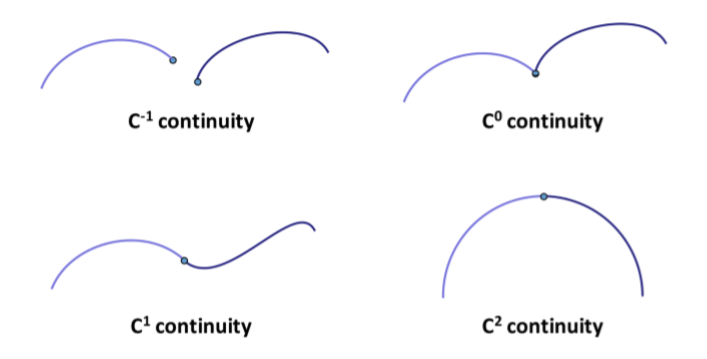

### 1.2. 几何连续性

* 曲线的几何连续性

	* 给定两条曲线

		$$
		\begin{align}
		&\pmb x_1(t)\ \mathrm{over}\ [t_0,t_1]\\
		&\pmb x_2(t)\ \mathrm{over}\ [t_1,t_2]
		\end{align}
		$$
		
	* 若$\pmb x_1$和$\pmb x_2$能够以某种方式重新参数化使得在$t_1$处$C^r$连续，则$\pmb x_1$和$\pmb x_2$在$t_1$处$G^r$连续
	
* 常见的几何连续性

	* $G^0=C^0$：位置变化连续性（连接性）（position varies continuously）
	* $G^1$：切线方向变化连续性（相同切线）（ tangent direction varies continuously ）
		* 正则化切线变化连续
		* 等价于曲线能够重新参数化到$C^1$
		* 等价于单位速度参数化为$C^1$
	* $G^2$：曲率变化连续性（相同切线与曲率）（curvature varies continuously）
		* 等价于曲线能够重新参数化到$C^2$
		* 等价于单位速度参数化为$C^2$

### 1.3. 参数连续性 vs 几何连续性

|                       参数连续性$C^r$                        |     几何连续性$G^r$      |
| :----------------------------------------------------------: | :----------------------: |
|                     $C^0,C^1,\cdots$连续                     |     曲线本身是否光滑     |
| 在该曲线上运动的粒子是否有光滑的轨迹？（位置、速度、加速度） |     独立于参数化方式     |
|                       取决于参数化方式                       | 与建模更相关（曲线设计） |
|              应用：动画（物体移动、摄像头轨迹）              |                          |

## 2. Bezier样条参数化

### 2.1. Bezier样条曲线的局部和全局参数

* 给定
	* $\pmb b_0,\cdots,\pmb b_n$
	* $\pmb y(u)$：间隔$[0,1]$之间的Bezier曲线
	* $\pmb x(t)$：间隔$[t_i,t_{i+1}]$之间的Bezier曲线
* 设置$u(t)=\dfrac{t-t_i}{t_{i+1}-t_i}$
* 结果：$\pmb x(t)=\pmb y(u(t))$

局部参数$u$从0变化到1，全局参数$t$从$t_i$变化到$t_{i+1}$

### 2.2. Bezier样条曲线的导数

$$
\begin{align}
\dot{\pmb x}(t)&=\dot{\pmb y}(u(t))\cdot\dot u(t)=\dfrac{\dot{\pmb y}(u(t))}{t_{i+1}-t_i}\\
\ddot{\pmb x}(t)&=\ddot{\pmb y}(u(t))\cdot(\dot u(t))^2+\dot{\pmb y}(u(t))\cdot\ddot u(t)=\dfrac{\ddot{\pmb y}(u(t))}{(t_{i+1}-t_i)^2}\\
\cdots\\
\pmb x^{[n]}(t)&=\dfrac{\pmb y^{[n]}(u(t))}{(t_{i+1}-t_i)^n}
\end{align}
$$

### 2.3. Bezier曲线

$$
\pmb f(t)=\sum_{i=0}^nB_i^n(t)\pmb p_i
$$

* $\{0,1\}$之间的函数值
	$$
	\begin{align}
	\pmb f(0)&=\pmb p_0\\
	\pmb f(1)&=\pmb p_1\\
	\end{align}
	$$

* $\{0,1\}$之间的一阶导数向量
	$$
	\begin{align}
	\pmb f'(0)&=n[\pmb p_1-\pmb p_0]\\
	\pmb f'(1)&=n[\pmb p_n-\pmb p_{n-1}]\\
	\end{align}
	$$

* $\{0,1\}$之间的二阶导数向量
	$$
	\begin{align}
	\pmb f''(0)&=n(n-1)[\pmb p_2-2\pmb p_1+\pmb p_0]\\
	\pmb f''(1)&=n(n-1)[\pmb p_n-2\pmb p_{n-1}+\pmb p_{n-2}]\\
	\end{align}
	$$

### 2.4. Bezier样条曲线的特殊情况

$$
\begin{align}
\dot{\pmb x}(t_i)&=\dfrac{n(\pmb b_1-\pmb b_0)}{t_{i+1}-t_i}\\
\dot{\pmb x}(t_{i+1})&=\dfrac{n(\pmb b_n-\pmb b_{n-1})}{t_{i+1}-t_i}\\
\ddot{\pmb x}(t_i)&=\dfrac{n(n-1)(\pmb b_2-2\pmb b_1+\pmb b_0)}{(t_{i+1}-t_i)^2}\\
\ddot{\pmb x}(t_{i+1})&=\dfrac{n(n-1)(\pmb b_n-2\pmb b_{n-1}+\pmb b_{n-2})}{(t_{i+1}-t_i)^2}\\
\end{align}
$$

### 2.5. Bezier样条的一般情况

* 连接Beizer曲线

	* 给定两条$n$阶Bezier曲线：
		$$
		\begin{align}
		\pmb k_{j-1}&=\pmb b_0^-,\pmb b_1^-,\cdots,\pmb b_n^-=\pmb k_j\\
		\pmb k_j&=\pmb b_0^+,\pmb b_1^+,\cdots,\pmb b_n^+=\pmb k_{j+1}
		\end{align}
		$$
		

	* 要求：$\pmb k_j$处$C^1$连续

	* $\pmb b_{n-1}^-,\pmb k_j,\pmb b_1^+$不共线且
		$$
		\dfrac{\pmb b_n^--\pmb b_{n-1}^-}{t_j-t_{j-1}}=\dfrac{\pmb b_1^+-\pmb b_0^+}{t_{j+1}-t_j}
		$$
		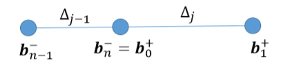

## 4. Bezier样条阶数

### 4.1. 可选的方案

* $d=0$，分段常数（piecewise constant）：不光滑
* $d=1$，分段线性（piecewise linear）：不够光滑
* $d=2$，分段二次（piecewise quadratic）：二阶导数为常数，不够灵活
* $d=3$，分段三次（piecewise cubic）：计算机图形学应用中常用的阶数

### 4.2. 三次样条

#### 4.2.1. 三次分段多项式

* 我们可以在不固定整个曲线的二阶导数的情况下获得$C^2$连续性（？）

* $C^2$连续性在直觉上很重要

	* 运动：连续的位移、速度和加速度

		非连续的加速度是可察觉的（物体、摄像机运动）

	* 可以看到二阶阴影不连续（反射性的物体）

* 在所有点集内插得到的$C^2$曲线中（满足相同的始末状态），分段三次曲线拥有最小的积分加速度（即所能获得的最光滑的曲线）

#### 4.2.3. 应用

* 三次Bezier曲线被广泛使用
* 更高阶的Bezier曲线较少使用（某些CAD/CAM应用）
* 典型的："points&handles"接口
* 四种模式
	* 不连续（两条曲线）
	* $C^0$连续（两个点重合）
	* $G^1$连续（切向连续）
		* 处理点指向同一方向，但长度不同
	* $C^1$连续
		* 处理点有对称向量
* $C^2$的限制更大：通过$k_i$进行控制

## 5. Bezier样条的连续性

### 5.1. Bezier样条连续性规则

连接多条曲线段，需要确定使曲线有$C^{-1},C^0，C^1，C^2$连续性的控制点约束

**$C^0$连续性**

* 每个样条线段内插第一个和最后一个控制点
* 相邻线段的点必须重合以获得$C^0$连续性

**$C^1$连续性**

* 切向量与向量差$\pmb p_1-\pmb p_0,\pmb p_n-\pmb p_{n-1}$成正比
* 这些向量应相同以满足$C^1$连续性

**$C^2$连续性**

* $\mathrm d^2/\mathrm dt^2$向量与$\pmb p_2-2\pmb p_1+\pmb p_0$和$\pmb p_n-2\pmb p_{n-1}+\pmb p_{n-2}$成正比
* 切线必须相同
* 下示阴影三角形必须相似

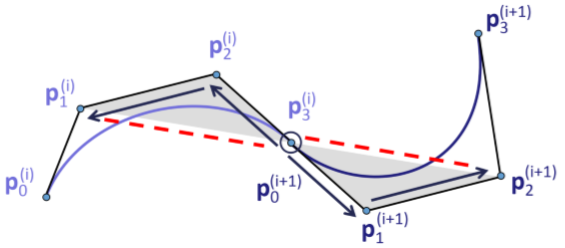

**$G^1$连续性**

能够被参数化为$C^1$，只需按切线向量长度的比率增加第二个曲线段的速度

## 6. Bezier样条曲线

### 6.1. 在某点处$C^2$连续

要求：在$\pmb k_j$处$C^2$连续

* $C^1$意味着
	$$
	\dfrac{\pmb b_n^--\pmb b_{n-1}^-}{t_j-t_{j-1}}=\dfrac{\pmb b_1^+-\pmb b_0^+}{t_{j+1}-t_j}
	$$

* $C^2$意味着
	$$
	\dfrac{\pmb b_n^--2\pmb b_{n-1}^-+\pmb b_{n-2}^-}{(t_j-t_{j-1})^2}=\dfrac{\pmb b_2^+-2\pmb b_1^++\pmb b_0^+}{(t_{j+1}-t_j)^2}
	$$

* 令
	$$
	\pmb d^-=\pmb b_{n-1}^-+\dfrac{\Delta_j}{\Delta_{j-1}}(\pmb b_{n-1}^--\pmb b_{n-2}^-)
	$$
	和
	$$
	\pmb d^+=\pmb b_1^+-\dfrac{\Delta_{j-1}}{\Delta_j}(\pmb b_2^+-\pmb b_1^+)
	$$
	则有：

	$C^2$连续性$\Leftrightarrow C^1$连续性+$\pmb d^-=\pmb d^+$

	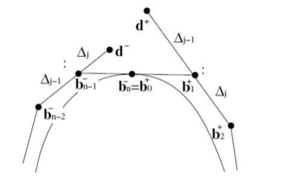

### 6.2. 曲线的$G^2$连续性

一般情况下的$G^2$连续性（对所有类型的曲线）

* 给定

	* $\pmb x_1(t)$和$\pmb x_2(t)$满足
	* $\pmb x_1(t_i)=\pmb x_2(t_i)=\pmb x(t_i)$
	* $\dot{\pmb x}_1(t_i)=\dot{\pmb x}_2(t_i)=\dot{\pmb x}(t_i)$

* 满足在$t=t_i$处$G^2$连续的条件是：
	$$
	\ddot{\pmb x}_2(t_i)-\ddot{\pmb x}_1(t_i)\parallel \dot{\pmb x}(t_i)
	$$
	

### 6.3. 某点的$G^2$连续性

* 要求：曲线在点$\pmb k_j$处$G^2$连续

* $G^1$连续

* $\pmb b_{n-2}^-,\pmb b_{n-1}^-,\pmb k_j,\pmb b_1^+,\pmb b_2^+$五个向量共面

* 且面积
	$$
	\dfrac{\mathrm{area}(\pmb b_{n-2}^-,\pmb b_{n-1}^-,\pmb k_j)}{\mathrm {area}(\pmb k_j,\pmb b_1^+,\pmb b_2^+)}=\dfrac{a^3}{b^3}
	$$
	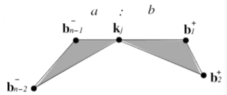

## 7. $C^2$三次Bezier样条曲线

### 7.1. 三次Bezier样条曲线

* 给定
	$$
	\begin{align}
	\pmb k_0,\cdots,\pmb k_n&\in\mathbb R^3\\
	t_0,\cdots,t_n&\in\mathbb R\\
	t_i&<t_{i+1}\ \mathrm{for}\ i=0,\cdots,n_1
	\end{align}
	$$

* 目标：插值$C^2$连续分段三次Bezier样条曲线的Bezier点$\pmb b_0,\cdots,\pmb b_{3n}$

* 例子：

	

	* $3n+1$未知点
	* $\pmb b_{3i}=\pmb k_i$，$i=0,\cdots,n$，共$n+1$个方程
	* 点$\pmb k_i$处$C^1$连续，$i=1,\cdots,n-1$，共$n-1$个方程
	* 点$\pmb k_i$处$C^2$连续，$i=1,\cdots,n-1$，共$n-1$个方程
	* 两个结束条件方程

### 7.2. 结束条件

#### 7.2.1. Bessel end condition

* $\pmb k_0$处的切向量等价于插值$\{\pmb k_0,\pmb k_1,\pmb k_2\}$的抛物线在$\pmb k_0$处的切向量

* 抛物线插值$\{\pmb k_0,\pmb k_1,\pmb k_2\}$
	$$
	\pmb p(t)=
	\dfrac{(t_2-t)(t_1-t)}{(t_2-t_0)(t_1-t_0)}\pmb k_0+
	\dfrac{(t_2-t)(t-t_0)}{(t_2-t_1)(t_1-t_0)}\pmb k_1+
	\dfrac{(t_0-t)(t_1-t)}{(t_2-t_1)(t_2-t_0)}\pmb k_2
	$$

* 插值抛物线导数
	$$
	\dot{\pmb p}(t_0)=
	-\dfrac{(t_2-t_0)+(t_1-t_0)}{(t_2-t_0)(t_1-t_0)}\pmb k_0+
	\dfrac{(t_2-t_0)}{(t_2-t_1)(t_1-t_0)}\pmb k_1-
	\dfrac{(t_1-t_0)}{(t_2-t_1)(t_2-t_0)}\pmb k_2
	$$

* $\pmb b_1$的位置
	$$
	\pmb b_1=\pmb b_0+\dfrac{t_1-t_0}{3}\dot{\pmb p}(t_0)
	$$

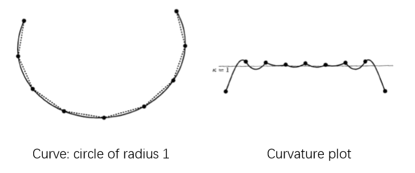

#### 7.2.2. Natural end condition

$$
\begin{align}
\ddot {\pmb x}(t_0)&=0\Leftrightarrow \pmb b_1=\dfrac{\pmb b_2+\pmb b_0}{2}\\
\ddot{\pmb x}(t_n)&=0\Leftrightarrow \pmb b_{3n-1}=\dfrac{\pmb b_{3n-2}+\pmb b_{3n}}{2}

\end{align}
$$

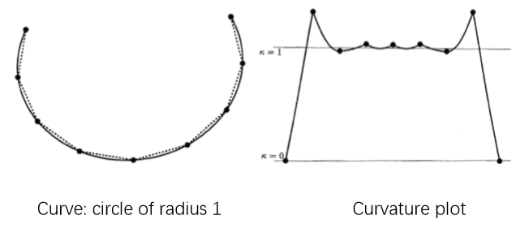

### 7.3. 参数化

#### 7.3.1. 问题描述

* 给定：控制点$\pmb k_0,\cdots,\pmb k_n$以及结序列$t_0<\cdots<t_n$
* 目标：插值曲线
* 问题：通常情况下，结序列未给定，但会影响曲线的走势

#### 7.3.2. Equidistant (uniform) parameterization

* $t_{i+1}-t_i=\mathrm{const}$
* 例如：$t_i=t$
* 不考虑数据点的几何形状

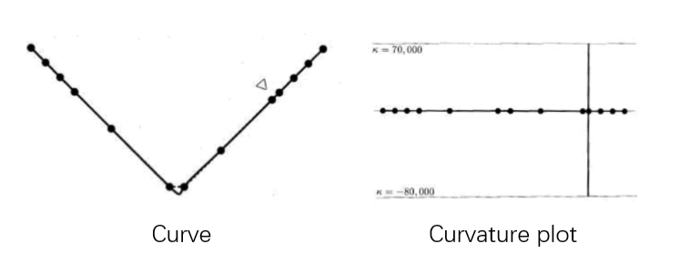

#### 7.3.3. Chordal parameterization

* $t_{i+1}-t_i=\Vert \pmb k_{i+1}-\pmb k_i\Vert$
* 参数间隔与相邻控制点的距离成正比

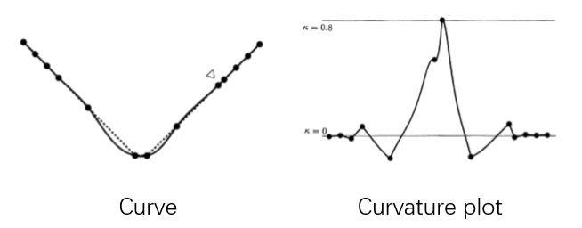

#### 7.3.4. Centripetal parameterization

* $t_{i+1}-t_i=\sqrt{\Vert\pmb k_{i+1}-\pmb k_i\Vert}$

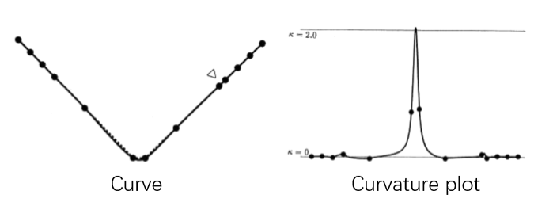

#### 7.3.5. Foley parameterization

* 涉及控制多边形的角度
* $t_{i+1}-t_i=\Vert\pmb k_{i+1}-\pmb k_i\Vert\cdot\Big(1+\dfrac{3}{2}\dfrac{\hat\alpha_i\Vert\pmb k_i-\pmb k_{i-1}\Vert}{\Vert\pmb k_i-\pmb k_{i-1}\Vert+\Vert\pmb k_{i+1}-\pmb k_i\Vert}+\dfrac{3}{2}\dfrac{\hat\alpha_{i+1}\Vert \pmb k_{i+1}-\pmb k_i\Vert}{\Vert\pmb k_{i+1}-\pmb k_i\Vert+\Vert\pmb k_{i+2}-\pmb k_{i+1}\Vert} \Big)$
* 其中，$\hat\alpha_i=\min\Big(\pi-\alpha_i,\dfrac{\pi}{2}\Big)$
* 且$\alpha_i=\mathrm{angle}(\pmb k_{i-1},\pmb k_i,\pmb k_{i+1})$

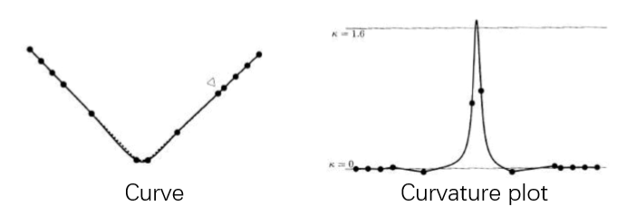

#### 7.3.6. Affine invariant parameterization

* 基于仿射不变距离测度的参数化

### 7.4. 闭合曲线

#### 7.4.1. 问题描述

* 给定：

	控制点：$\pmb k_0,\cdots,\pmb k_{n-1},\pmb k_n=\pmb k_0$

	结序列：$t_0<\cdots<t_n$

* 分段三次曲线的结束条件：
	$$
	\begin{align}
	\dot{\pmb x}(t_0)&=\dot{\pmb x}(t_n)\\
	\ddot{\pmb x}(t_0)&=\ddot{\pmb x}(t_n)
	\end{align}
	$$

#### 7.4.2. 闭合三次Bezier样条曲线

* $C^2$连续且曲线闭合

* 闭合曲线的优势：无需选择结束条件

* 例子：

	$n=3$

