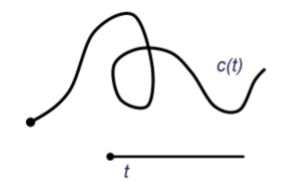
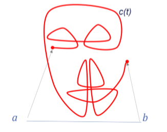
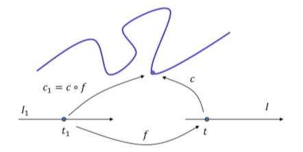
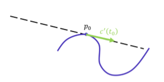
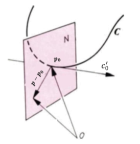
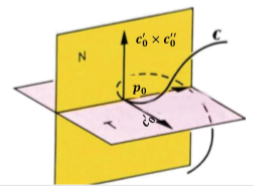
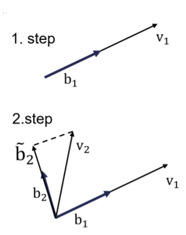

# 曲线微分几何

## 1. 参数曲线

### 1.1. 直观简介

* 参数曲线$c$可以视为移动粒子的运动轨迹
* 参数$t$可视为时间参数

### 1.2. 数学描述

#### 1.2.1. 定义

$\mathbb R^n$中的曲线类$C^k(k\geq 1)$的参数化是光滑映射$c:I=[a,b]\subset \mathbb R\rightarrow\mathbb R^n$，其中$c$属于类$C^k$

#### 1.2.2. 迹线（trace）

图像集合$c(I)$称为曲线的**迹线**

* 不同的参数化可能有相同的迹线

#### 1.2.3. 自相交（self-intersection）

迹线中的一个点对应多个参数值$t$，则称曲线的自相交

#### 1.2.4. 速度向量

曲线$c$在时刻$t$的导数$c'(t)$称为曲线的速度向量

* $c'(t)$给定移动的方向
* $|c'(t)|$给定速度大小

### 1.3. 正则参数曲线（Regular parametric curves）

* 正则参数化
	* 对于所有的$t$，有$c'(t)\neq 0$
	* 正则曲线上的点称为平凡（ordinary）点
	* 非正则曲线上的点称为奇异（singular）点

### 1.4. 参数的变换

给定一个光滑的正则参数化，参数所允许的更改为任意光滑（可微）函数

$$
f:I_1\rightarrow I\ 
\mathrm{such}\ \mathrm{that}\
f'\neq 0\ \mathrm{on}\ I_1
$$

当$f'>0$将保持方向

* 我们可以将正则曲线视为正则参数化的集合，其中任意两个参数都是彼此之间的重新参数化（等价类）
* 我们对参数变换下的不变量感兴趣

### 1.5. 几何观察

**切线向量（Tangent vector）**

* 正则曲线$c(t)$在点$\pmb p_0=\pmb c(t_0)$处的**正弦线**定义为满足$\pmb p-\pmb p_0\parallel\pmb c_0'$的点$\pmb p$，其中$\pmb c'_0=\pmb c'(t_0)$
* 归一化向量$\pmb t=\dfrac{\pmb c'}{\vert c'\vert}$称为**切线向量**

**法平面（Normal plane）**

法平面描述为满足$\pmb p-\pmb p_0\perp\pmb c_0'$的点$\pmb p$，即

$$
(\pmb p-\pmb p_0)\cdot\pmb c_0'=0
$$

**密切平面（Osculating plane）**

* 假设曲线$\pmb c(t)$不是一条直线，任意三个不共线的点$\pmb p_1,\pmb p_2,\pmb p_3$，能够决定一个平面

* 如果$\pmb p_1,\pmb p_2,\pmb p_3$趋于于曲线$\pmb c$上的同一个点$\pmb p_0$，那么其构成的平面称为曲线$\pmb c$在点$\pmb p_0$处的密切平面$T$

* 若曲线在点$\pmb p_0$处的一阶导数$\pmb c_0'$和二阶导数$\pmb c''_0$线性独立，则密切平面给定为：

	$$
	(\pmb c_0'\times\pmb c_0'')\cdot(\pmb p-\pmb p_0)=0
	$$
	

观察$\pmb p(t+\Delta t)$与以$\pmb a$为法向量且穿过点$\pmb p(t)$的平面的距离，有

$$
\pmb a\cdot(\pmb p(t_0+\Delta t)-\pmb p(t_0))=\pmb a\cdot \Big(\dot{\pmb p}(t_0)\Delta t+\dfrac{\ddot{\pmb p}(t_0)}{2!}\Delta t^2+\cdots \Big)
$$

当距离取最小值时，有

$$
\pmb a\cdot\dot{\pmb P}(t_0)=0,\ \ \ \
\pmb a\cdot\ddot{\pmb P}(t_0)=0
$$

此时取得密切平面，密切平面是曲线在$\pmb p(t_0)$处的最优拟合平面

**从切平面（Rectifying plane）**

同时垂直于密切平面和法平面的平面称为从切平面$R$，从切平面上的点$\pmb p$满足
$$
(\pmb c_0'\times(\pmb c_0'\times\pmb c_0''))\cdot(\pmb p-\pmb p_0)=0
$$

**法向量**

法平面内的任何向量均为曲线的法向量，特别地

* 点$\pmb p_0$处同时位于密切平面内的法向量$\pmb n$（密切平面与法平面交线）称为**主法向量（principal normal ）**

	$$
	(\pmb c_0'\times\pmb c_0'')\times\pmb c_0'
	$$

* 点$\pmb p_0$处同时位于从切平面的法向量$\pmb b$称为**副法向量（binormal）**

	$$
	\pmb c_0'\times\pmb c_0''
	$$
	

**Frenet标架**

通过以下三个正交向量构造曲线上的局部坐标架

* 切线向量
	
	$$
	\pmb t=\dfrac{\pmb c'}{\|\pmb c_0'\|}
	$$

* 副法向量
	
	$$
	\pmb b=\dfrac{\pmb c_0'\times\pmb c_0''}{\|\pmb c_0'\times\pmb c_0''\|}
	$$
	
* 主法向量
	
	$$
	\pmb n=\pmb b\times\pmb t
	$$
	

对应的关联平面：

* 法平面
	
	$$
	(\pmb p-\pmb p_0)\cdot\pmb t=0
	$$

* 密切平面
	
	$$
	(\pmb p-\pmb p_0)\cdot\pmb b=0
	$$

* 从切平面
	
	$$
	(\pmb p-\pmb p_0)\cdot\pmb n=0
	$$
	

**曲率**

* 曲率的基本概念
	* 测量曲线的弯曲程度
	* 直线没有弯曲 → 曲率为0
	* 圆有固定的弯曲程度 → 曲率为常数

* 曲率的计算

    $$
    \kappa(t)=\dfrac{\|\pmb c'(t)\times\pmb c''(t)\|}{\|\pmb c'(t)\|^3}
    $$

	特别地，对于平面曲线$\pmb c(t)=(x(t),y(t))$
    
    $$
    \kappa(t)=\dfrac{|x'y''-x''y'|}{(x'^2+y'^2)^{\frac{3}{2}}}
    $$
	
	曲率半径:$r(t)=\dfrac{1}{\kappa(t)}$

**挠率**

* 定义

	* 挠率$\tau$衡量副法向量的变化

	* （曲线从其在密切平面上的投影的偏移量可以视为曲线离平面曲线有多远），由下式给出

		$$
		\tau(t)=\dfrac{(\pmb c'\times\pmb c'')\cdot\pmb c'''}{\|\pmb c'\times\pmb c''\|^2}
		$$
		

**曲线的长度**

* 曲线的弧长

	* 正则曲线$C$的弧长定义为：
	
		$$
		\mathrm{length}_c=\int_a^b\|\dot{\pmb c}\|\mathrm dt
		$$
		
	* 独立于参数的选取

## 2. 弧长曲线曲线

### 2.1. 弧长参数化

* 考虑$\pmb c(t)$从0到$t$跨度的部分，该段弧长$s$为一个关于$t$的函数

	$$
	s(t)=\int_0^t\|\pmb c'(u)\|\mathrm du
	$$
	
* 由于$\dfrac{\mathrm ds}{\mathrm dt}=\vert\vert \pmb c'(u)\vert\vert>0$，$s$可以作为新的参数化方式

* 易得：

	$$
	\pmb c'(s)=\dfrac{\mathrm d\pmb c}{\mathrm ds}=\dfrac{\mathrm d\pmb c/\mathrm dt}{\mathrm ds/\mathrm dt}\Rightarrow \|\pmb c'(s)\|=1
	$$
	
* $\pmb c(s)$称为弧长（单位速度）参数化曲线，参数$s$称为弧长或自然参数

### 2.2. 用弧长进行参数化

* 弧长（或单位速度）参数化
	* 任意正则曲线都存在弧长参数化
	* 不意味着弧长参数化能够被计算

### 2.3. 弧长参数化的几何结果

* 由于$\vert\vert\pmb c'(u)\vert\vert=1$，有$\pmb c'\cdot\pmb c'=1$，取导数得到$\pmb c'\cdot\pmb c''=0$

* $\pmb c''$与$\pmb c'$互相垂直（均位于密切平面）

* 因此$\pmb c''$的方向向量可作为主法向量（$\pmb c''\neq \pmb 0$）
	
	$$
	\pmb n=\dfrac{\pmb c''}{\|\pmb c''\|}
	$$
	

### 2.4. 曲率

* 弧长参数曲线$\pmb c(u)$的曲率为
	
	$$
	\kappa=\|\pmb c''(u)\|
	$$
	

## 3. Frenet曲线

### 3.1. 基本概念

* Frenet曲线
	* Frenet曲线是$\mathbb R^n$内的弧长参数曲线$\pmb c$，满足$\pmb c'(s),\pmb c''(s),\cdots,\pmb c^{n-1}(s)$线性独立
* Frenet标架
	* 每条Frenet曲线都有一个独一无二的Frenet标架$\pmb e_1(s),\pmb e_2(s),\cdots,\pmb e_n(s)$，满足
		* $\pmb e_1(s),\pmb e_2(s),\cdots,\pmb e_n(s)$正交且正向
	* 对$\{\pmb c',\pmb c'',\cdots,\pmb c^n\}$应用Gram-Schmidt正交化

### 3.2. Gram-Schmidt处理

* 输入：线性独立向量集合$\{\pmb v_1,\pmb v_2,\cdots,\pmb v_n\}$
* 输出：正交向量集合$\{\pmb b_1,\pmb b_2,\cdots,\pmb b_n\}$
	* 设$\pmb b_1=\dfrac{\pmb v_1}{\vert\vert\pmb v_1\vert\vert}$
	* 循环：For $k=2,\cdots,n$
		* $\tilde{\pmb  b_k}=\pmb v_k-\sum_{i=1}^{k-1}\langle \pmb v_k,\pmb b_i\rangle \pmb b_i$
		* $\pmb b_k=\dfrac{\tilde {\pmb b_k}}{\vert\vert\tilde {\pmb b_k}\vert\vert}$

### 3.3. 平面曲线

现在用Frenet标架下弧长参数化表示平面曲线

法向量：

$$
\pmb e_2(s)=R^{90^\circ}\pmb e_1(s)
$$

标架方程：

$$
\begin{pmatrix}
\pmb e_1(s)\\\pmb e_2(s)
\end{pmatrix}'=
\begin{pmatrix}
0&\kappa(s)\\
-\kappa(s)&0
\end{pmatrix}
\begin{pmatrix}
\pmb e_1(s)\\\pmb e_2(s)
\end{pmatrix}
$$

有向曲率：

$$
\kappa(s)=\langle\pmb e_1'(s),\pmb e_2(s)\rangle=\dfrac{\langle\ddot {\pmb c}(t),R^{90^\circ}\dot{\pmb c}(t) \rangle}{\|\dot{\pmb c}(t)\|^3}
$$

密切圆：

* 半径：$1/\kappa$
* 圆心：$\pmb c(s)+\dfrac{1}{\kappa}\pmb e_2(s)$

**平面曲线的基本定理**

* 令$\kappa:(a,b)\rightarrow\mathbb R$是一个光滑函数。对于某些$s_0\in(a,b)$，假设我们有给定点$\pmb p_0$和两个正交向量$\pmb t_0$和$\pmb n_0$，则存在唯一一个Frenet曲线$\pmb c:(a,b)\rightarrow\mathbb R^2$，有：
	* $\pmb c(s_0)=\pmb p_0$
	* $\pmb e_1(s_0)=\pmb t_0$
	* $\pmb e_2(s_0)=\pmb n_0$
	* 曲线$\pmb c$的曲率$c$等于给定函数$\pmb \kappa$
* 换句话说，对于任意光滑函数，存在唯一一条直线以该函数作为其曲率

### 3.4. 性质

* 刚性运动
	* 刚性运动：$\pmb x\rightarrow A\pmb x+\pmb b$，其中$A$为正交矩阵（保距离的仿射映射）
		* 当$\det \pmb A=+1$时保方向（非镜面）
		* 镜面$\det\pmb A=-1$
* 平面曲线在刚性运动下的不变性
	* 曲率在刚性运动下不变
		* 绝对值不变
		* 如果是保方向刚性运动，则有向值不变
* 平面曲线的刚度
	
* 具有相同有向曲率函数的两条Frenet曲线的区别仅因保方向刚性运动而不同
	
* 弧长导数

	* 弧长参数化

		* 找到参数曲线的一个弧长参数化往往是很困难的
		* Frenet标架及其导数依旧是可以计算的，这里定义了弧长导数

	* 弧长导数

		* 对于参数曲线$\pmb c:[a,b]\rightarrow\mathbb R^n$，定义任意可微函数$f:[a,b]\rightarrow\mathbb R$的弧长导数为
			$$
			\pmb f'(t)=\dfrac{1}{\|\dot{\pmb c}(t)\|}\dot{\pmb f}(t)
			$$

### 3.5. 空间曲线

$\mathbb R^3$中的Frenet标架

* 切线向量

	$$
	\pmb e_1(s)=\pmb c'(s)
	$$

* 法向量
	
	$$
	\pmb e_2(s)=\dfrac{1}{\|\pmb c''(t)\|}\pmb c''(t)
	$$

* 副法向量
	
	$$
	\pmb e_3(s)=\pmb e_1(s)\times\pmb e_2(s)
	$$

* Frenet-Serret方程：

$$
\begin{pmatrix}
\pmb e_1(s)\\\pmb e_2(s)\\\pmb e_3(s)
\end{pmatrix}=
\begin{pmatrix}
0&\kappa(s)&0\\-\kappa(s)&0&\tau(s)\\0&-\tau(s)&0
\end{pmatrix}
\begin{pmatrix}
\pmb e_1(s)\\\pmb e_2(s)\\\pmb e_3(s)
\end{pmatrix}
$$

* 有向曲率：$\kappa(s)=\langle \pmb e_1'(s),\pmb e_2(s)\rangle$

* 挠率：$\tau(s)=\langle\pmb e_2'(s),\pmb e_3(s)\rangle$，测量曲线如何弯曲超出$\pmb e_1$和$\pmb e_2$的平面

* $\mathbb R^n$中曲线的Frenet方程表示为：

$$
\begin{pmatrix}
\pmb e_1(s)\\\pmb e_2(s)\\\vdots\\\pmb e_n(s)
\end{pmatrix}=
\begin{pmatrix}
0&\kappa_1(s)&0&\cdots&0&0\\
-\kappa_1(s)&0&\kappa_2(s)&\cdots&0&0\\
0&-\kappa_2(s)&0&\cdots&0&0\\
\vdots&\vdots&\vdots&\ddots&\vdots&\vdots\\
0&0&0&\cdots&0&\kappa_{n-1}(s)\\
0&0&0&\cdots&-\kappa_{n-1}(s)&0
\end{pmatrix}
\begin{pmatrix}
\pmb e_1(s)\\\pmb e_2(s)\\\vdots\\\pmb e_n(s)
\end{pmatrix}
$$

* 函数$\kappa_i(s)$称为$i$次Frenent曲率

## 小结

* 对于正则曲线

	* 切线向量：$\pmb t=\dfrac{\pmb c'}{\vert\vert\pmb c'\vert\vert}$，法平面：$(\pmb p-\pmb p_0)\cdot\pmb t=0$
	* 副法向量：$\pmb b=\dfrac{\pmb c'\times\pmb c''}{\vert\vert\pmb c'\times\pmb c''\vert\vert}$，密切平面：$(\pmb p-\pmb p_0)\cdot\pmb b=0$
	* 主法向量：$\pmb n=\pmb b\times\pmb t$，从切平面：$(\pmb p-\pmb p_0)\cdot\pmb n=0$
	* 曲率：$\kappa(t)=\dfrac{\pmb c'\times\pmb c''}{\vert\vert\pmb c'\vert\vert^3}$
	* 挠率：$\tau(t)=\dfrac{(\pmb c'\times\pmb c'')\cdot\pmb c'''}{\vert\vert\pmb c'\times\pmb c''\vert\vert^2}$

* 弧长参数（单位速度）曲线$\pmb c(s)$

	* 切线向量：$\pmb t=\pmb c'$
	* 副法向量：$\pmb b=\pmb t\times\pmb n$
	* 主法向量：$\pmb n=\dfrac{\pmb t'}{\vert\vert\pmb t'\vert\vert}=\dfrac{\pmb c''}{\vert\vert\pmb c''\vert\vert}$
	* 曲率：$\kappa(t)=\vert\vert\pmb t'\vert\vert=\vert\vert\pmb c''\vert\vert$
	* 有向曲率：$\kappa(s)=\pmb t'=\pmb c''$
	* 挠率：$\tau(t)=-\pmb b'\cdot\pmb n$

* 特殊情况：平面曲线

	* 对于正则平面曲线$\pmb c(t)=(x(t),y(t))$，其曲率定义为

		$$
		\kappa(t)=\dfrac{|x'y''-x''y'|}{(x'^2+y'^2)^{\frac{3}{2}}}
		$$

	* 有向曲率

		$$
		\kappa(t)=\dfrac{x'y''-x''y'}{(x'^2+y'^2)^{\frac{3}{2}}}
		$$