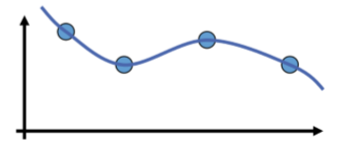
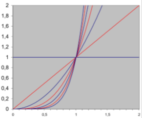

# CAGD(1) | 插值与逼近

## 1. 插值

### 1.1. 插值问题的描述

#### 1.1.1. 问题的一般形式

* 寻找定义域$\Omega\subseteq \mathbb R^d $，值域$\mathbb R$上的函数$f:\Omega\rightarrow\mathbb R$
* 基函数集合：$B=\{b_1,\cdots,b_n\}$，$b_i:\Omega\rightarrow\mathbb R$

* 将$f$表示为基函数的线性组合

$$
f_\lambda(x)=\sum\limits_{k=0}^n\lambda_ib_i(x)
$$

​	其中，$f$由$\lambda=\begin{pmatrix}\lambda_1\\\vdots\\\lambda_n\end{pmatrix}$唯一确定

* 函数值$\{(x_1,y_1), \cdots,(x_n,y_n)\}$，$(x_i,y_i)\in \mathbb R^d\times\mathbb R$
* 目标找到$\lambda$使得$f_\lambda(x_i)=y_i$对所有$i$成立

#### 1.1.2. 插值问题应用举例

最简单的光滑曲线曲面建模问题：

* 给定曲线或曲面上的一组点
* 选择一组可张成合适函数空间的基函数
	* 光滑基函数
	* 任意线性组合也为光滑函数
* 找到一个线性组合能够使得曲线或曲面能插值给定点

### 1.2. 插值问题的求解

构造线性方程组：

* 在数据点$x_i$上计算基函数：

$$
\forall i\in\{1,\cdots,n\}:\sum\limits_{i=1}^n\lambda_ib_i(x_i)=y_i
$$

* 写成矩阵形式：

$$
\begin{pmatrix}
b_1(x_1)&\cdots&b_n(x_1)\\
\vdots&\ddots&\vdots\\
b_1(x_n)&\cdots&b_n(x_n)
\end{pmatrix}
\begin{pmatrix}
\lambda_1\\\vdots\\\lambda_n
\end{pmatrix}=

\begin{pmatrix}
y_1\\\vdots\\y_n
\end{pmatrix}
$$

#### 1.2.1. 多项式插值示例

* 使用多项式基$B=\{1,x,x^2,x^3,\cdots,x^{n-1}\}$

* 求解线性方程组

	$$
	\begin{pmatrix}
	1&x_1&\cdots&x_1^{n-1}\\
	1&x_2&\cdots&x_2^{n-1}\\
	\vdots&\vdots&\ddots&\vdots\\
	1&x_n&\cdots&x_n^{n-1}
	\end{pmatrix}
	\begin{pmatrix}
	\lambda_1\\\lambda_2\\\vdots\\\lambda_n
	\end{pmatrix}
	=
	\begin{pmatrix}
	y_1\\y_2\\\vdots\\y_n
	\end{pmatrix}
	$$

#### 1.2.2. 多项式插值存在的问题

* 系统矩阵稠密
* 依赖于基函数选取，矩阵可能病态，导致难以求解（求逆）

**病态问题**

* 输入数据的细微变化导致输出（解）的剧烈变化

* 将线性方程看成直线（超平面）

	* 当系统病态时，直线编程近似平行
	* 求解（即直线求交）变得困难、不精确

* 举例：

	* 考虑二元方程组

		$x_1+0.5x_2=1.5$ 和 $0.667x_1+0.333x_2=1$

		解为$(1,1)$

	* 对第二个方程右边项扰动0.001

		$x_1+0.5x_2=1.5$ 和 $0.667x_1+0.333x_2=0.999$

		解为$(0,3)$

	* 对矩阵系数进行扰动

		$x_1+0.5x_2=1.5$ 和 $0.667x_1+0.334x_2=0.999$

		解为$(2,-1)$

#### 1.2.3. 矩阵条件数

$$
\kappa_2(A)=\dfrac{\max\limits_{x\neq 0}\dfrac{\|Ax\|}{\|x\|}}{\min\limits_{x\neq 0}\dfrac{\|Ax\|}{\|x\|}}
$$

* 等于最大特征值和最小特征值之间的比例
* 条件数大意味着基元之间有太多相关性

**考虑多项式插值**

* 多项式插值问题是病态的
	* 对于等距分布的数据点$x_i$，范德蒙矩阵的条件数随着数据点数$n$呈指数级增长（多项式最高次数为$n-1$）

原因：

* 幂（单项式）函数基

	

	* 幂函数之间差别随次数增加而减小
	* 不同幂函数之间唯一差别为增长速度

#### 1.2.4. 函数互相抵消

* 对于单项式函数基，从左到右，首先由常函数1主宰，接着$x$增长最快，接着$x^2$增长最快，接着$x^3$增长最快...

* 好的基函数一般需要系数交替以达到函数的互相抵消

**解决方法：**

* 使用正交多项式基
* 正交基获得方法：Gram-Schmidt正交化

### 1.3. 拉格朗日插值方法

拉格朗日插值方法避免求解线性方程组

#### 1.3.1. 拉格朗日插值的一般形式

* 构造插值问题的通用解

	* 给定$n+1$个点$\{(x_0,y_0),\cdots,(x_n,y_n) \}$，寻找一组次数为$n$的多项式基函数$l_i$使得

		$$
		l_i(x_j)=\begin{cases}
		1,&若i=j\\
		0,&若i\neq j
		\end{cases}
		$$
		
	
* 插值问题的解为

	$$
	P(x)=y_0l_0(x)+y_1l_1(x)+\cdots+y_nl_n(x)=\sum\limits_{i=0}^ny_il_i(x)
	$$
	

#### 1.3.2. 拉格朗日多项式的计算

* $n$阶多项式，且有以下$n$个根

	$$
	x_0,x_1,x_2,\cdots,x_{i-1},x_{i+1}\cdots,x_n
	$$
	
* 可表示为

	$$
	\begin{align}
	l_i(x)&=C_i(x-x_0)(x-x_1)\cdots(x-x_{i-1})(x-x_{i+1})\cdots(x-x_n)\\
	&=C_i\prod_{j\neq i}(x-x_j)
	\end{align}
	$$
	
* 由$l_i(x_i)=1$，可得

	$$
	1=C_i\prod_{j\neq i}(x_i-x_j)\Rightarrow C_i=\dfrac{1}{\prod_{j\neq i}(x_i-x_j)}
	$$
	
* 最终的多项式基函数为

	$$
	l_i(x)=\dfrac{\prod_{j\neq i}(x-x_j)}{\prod_{j\neq i}(x_i-x_j)}
	$$
	
	多项式$l_i(x)$称为**拉格朗日多项式**

#### 1.3.3. 拉格朗日插值 vs 单项式基插值

事实上，给定同一组输入点，利用拉格朗日多项式和利用范德蒙矩阵（单项式基）进行插值所得到的解完全相同

* 假设解不同。记两个解的差别多项式为$R_n$，$R_n$阶数至多为$n$
* 那么$R_n(x_i)=0$，$i=0,1,\cdots,n$，$x_i$为不同插值点。因此$R_n$是有$n+1$个根的$n$阶多项式，因此$R_n=0$

#### 1.3.4. 多项式插值分析

* 多项式插值不稳定
* 控制点的微小变化可导致完全不同的结果
* 振荡现象：多项式随着插值点数（可以是细微的）增加而摆动

解决方法：

* 使用更好的基函数做插值，例如：分片多项式

## 2. 逼近

### 2.1. 动机

#### 2.1.1. 使用逼近的原因

* 数据点含噪声（采样）
* 更紧凑的表达
* 计算简单

#### 2.1.2. 常用的逼近函数

* 多项式
* 有理函数（多项式商）
* 三角函数

### 2.2. 多项式逼近

#### 2.2.1. 万能逼近定理

又叫Weierstrass定理：

令$f$为闭区间$[a,b]$上任意连续函数，则对任意给定$\varepsilon$，存在$n$和多项式$P_n$使得
$$
|f(x)-P_n(x)|<\varepsilon,\forall x\in[a,b]
$$
Weierstrass只证明了存在性，而未给出多项式

#### 2.2.2. Bernstein多项式逼近

**Bernstein多项式构造定理**

对$[0,1]$区间上任意连续函数$f(x)$和任意正整数$n$，以下不等式对所有$x\in[0,1]$成立
$$
|f(x)-B_n(f,x)|<\dfrac{9}{4}m_{f,n}
$$

* $m_{f,n}=\mathop {\mathrm {lower\ upper\ bound}}\limits_{y_1,y_2\in[0,1]且|y_1-y_2|<\frac{1}{\sqrt{n}}}|f(y_1)-f(y_2)|$
* $B_n(f,x)=\sum_{j=0}^nf(x_j)b_{n,j}(x)$，其中$x_j$为$[0,1]$上等距采样点
* $b_{n,j}=\begin{pmatrix}n\\j\end{pmatrix}x^j(1-x)^{n-j}$为Bernstein多项式

**Bernstein多项式逼近特点**

* 逼近结果优秀，但需要高阶
* 计算昂贵
* 容易带来误差

### 2.3. 最小二乘逼近

#### 2.3.1. 逼近问题

* 给定一组线性无关的连续函数集合$B=\{b_1,\cdots,b_n\}$和一组结点$\{(x_1,y_1),\cdots,(x_m,y_m)\}$，其中$m>n$
* 在$B$张成空间中寻找对结点逼近最好的函数$f\in\mathrm{span}(B)$

#### 2.3.2. 最佳逼近的定义

**最小二乘逼近**
$$
\mathop{\mathrm{argmin}}\limits_{f\in\mathrm{span(B)}}
\sum\limits_{j=1}^m(f(x_j)-y_j)^2
$$

$$
\begin{align}
\sum\limits_{j=1}^m(f(x_j)-y_j)^2&=\sum\limits_{j=1}^m\Big(\sum\limits_{i=1}^n\lambda_ib_i(x_j)-y_j\Big)^2\\
&=(M\pmb\lambda-\pmb y)^T(M\pmb \lambda-\pmb y)\\
&=\pmb y^T\pmb y-2\pmb y^TM\pmb \lambda+\pmb \lambda^TM^TM\pmb \lambda
\end{align}
$$

其中，$\pmb \lambda=(\lambda_1,\lambda_2,\cdots,\lambda_n)^T$，$\pmb y=(y_1,y_2,\cdots,y_m)^T$，$M=\begin{pmatrix}b_1(x_1)&\cdots&b_n(x_1)\\\vdots&\ddots&\vdots\\b_1(x_m)&\cdots&b_n(x_m) \end{pmatrix}$

#### 2.3.3. 最小二乘解

* 关于$\pmb\lambda$的二次多项式

	$$
	\pmb\lambda^TM^TM\pmb\lambda-2\pmb y^TM\pmb \lambda+\pmb y^T\pmb y
	$$
	
* 最小解满足

	$$
	M^TM\pmb\lambda=M^T\pmb y
	$$