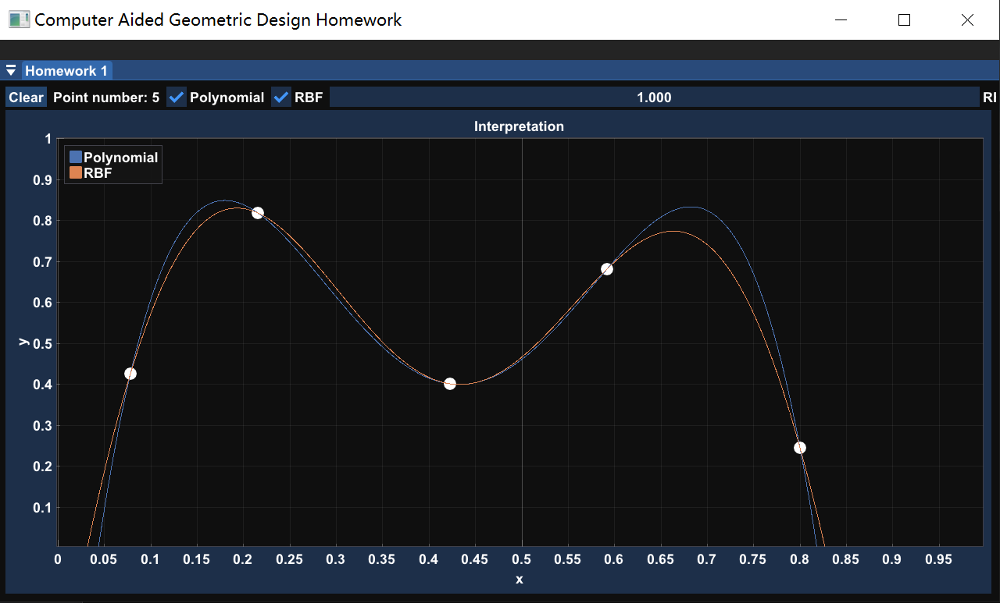
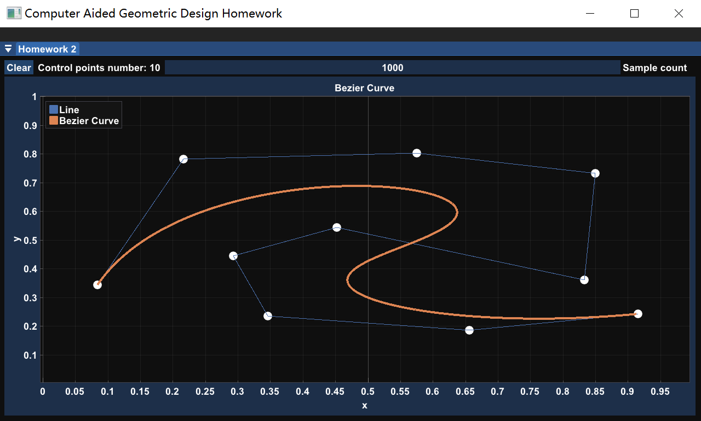
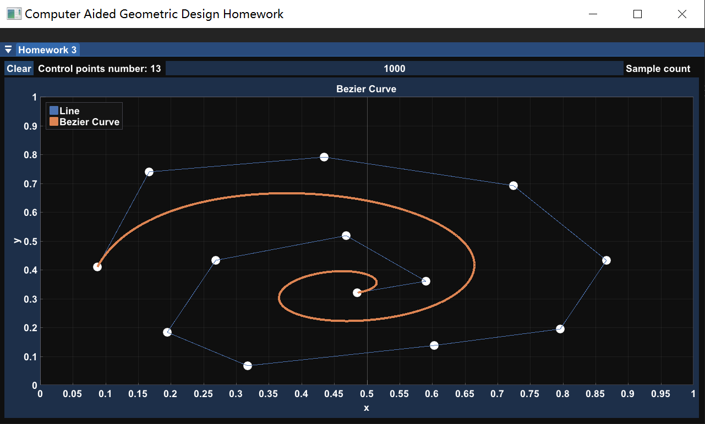

# Computer Aided Geometric Design

## Introduction

> **MATH6110P: Computer Aided Geometric Design (Autumn-Winter 2021-2022)**
>
> **Instructors**: [Renjie Chen](http://staff.ustc.edu.cn/~renjiec)
>
> **Webpage**: [ http://staff.ustc.edu.cn/~renjiec/Courses/CAGD_2021S1/default.htm](http://staff.ustc.edu.cn/~renjiec/CAGD_2021S1/default.htm)

## Assignments

### Homework#1: Data Interpolation

$$
\begin{pmatrix}
		\varphi_1(x_1) & \varphi_2(x_1) & \cdots & \varphi_n(x_1)\\\\
		\varphi_1(x_2) & \varphi_2(x_2) & \cdots & \varphi_n(x_2)\\\\
		\vdots & \vdots & \ddots & \vdots\\\\
		\varphi_1(x_n) & \varphi_2(x_n) & \cdots & \varphi_n(x_n)
	\end{pmatrix}
	\begin{pmatrix}
		\alpha_1\\\\\alpha_2\\\\\vdots\\\\\alpha_n
	\end{pmatrix}=
	\begin{pmatrix}
		y_1\\\\y_2\\\\\vdots\\\\y_n
	\end{pmatrix}
$$

### Homework#2: Bézier Curve(De Casteljau Algorithm)

$$
\begin{aligned}
		\begin{matrix}
			\pmb b^0_i(t)=\pmb b_i,&i=0,\cdots,n
		\end{matrix}\\\\
		\pmb b_i^r(t)=(1-t)\pmb b_i^{r-1}(t)+t\pmb b_{i+1}^{r-1}(t)\\\\
		\begin{matrix}
			r=1,\cdots,n&i=0,\cdots,n-r
		\end{matrix}
	\end{aligned}
$$

### Homework#3: Bézier Curve(Bernstein Basis)

$$
\begin{align}
\pmb f(t)&=\sum_{i=0}^nB_i^{(n)}(t)\pmb p_i\\\\
&=\sum_{i=0}^n\left(\begin{matrix}n\\\\i\end{matrix} \right)t^i(1-t)^{n-i}\pmb p_i
\end{align}
$$

