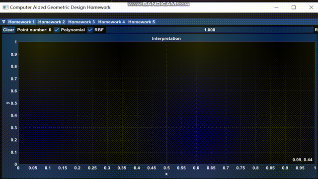
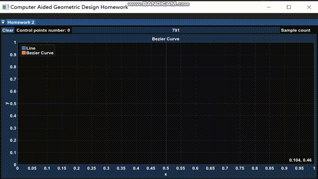
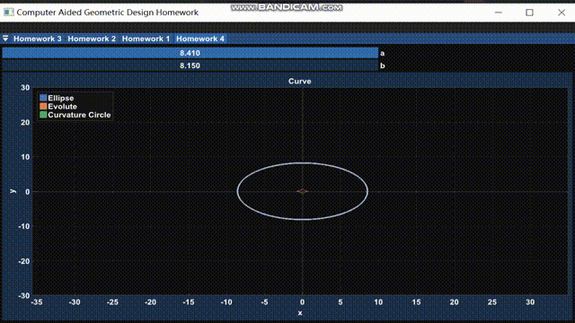
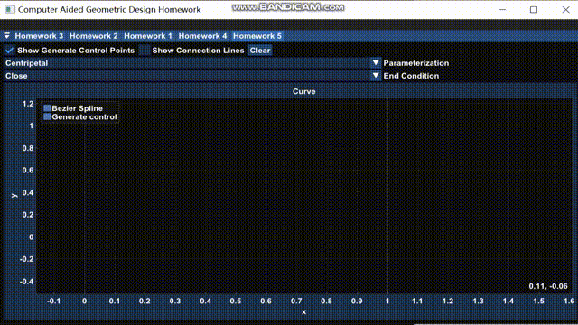
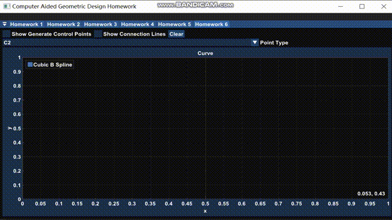
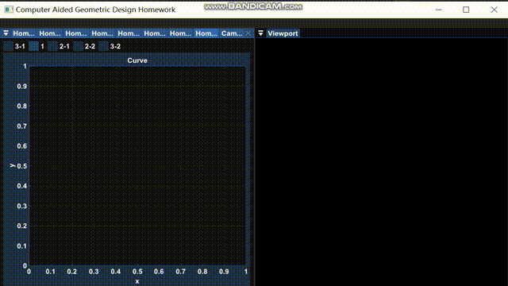

# Computer Aided Geometric Design

[](https://github.com/Chaphlagical/CAGD/actions/workflows/windows.yml)[](https://www.codacy.com/gh/Chaphlagical/CAGD/dashboard?utm_source=github.com&amp;utm_medium=referral&amp;utm_content=Chaphlagical/CAGD&amp;utm_campaign=Badge_Grade)

## Introduction

> **MATH6110P: Computer Aided Geometric Design (Autumn-Winter 2021-2022)**
>
> **Instructors**: [Renjie Chen](http://staff.ustc.edu.cn/~renjiec)
>
> **Webpage**: [ http://staff.ustc.edu.cn/~renjiec/Courses/CAGD_2021S1/default.htm](http://staff.ustc.edu.cn/~renjiec/CAGD_2021S1/default.htm)

## Build

* Visual Studio 2019
* CMake >= 3.14

```
git clone https://github.com/Chaphlagical/CAGD --recursive
```

`Configure`, `Generate`, and run `Homework`

## Assignments

### Homework#1: Data Interpolation

$$
\begin{pmatrix}
		\varphi_1(x_1) & \varphi_2(x_1) & \cdots & \varphi_n(x_1)\\\\
		\varphi_1(x_2) & \varphi_2(x_2) & \cdots & \varphi_n(x_2)\\\\
		\vdots & \vdots & \ddots & \vdots\\\\
		\varphi_1(x_n) & \varphi_2(x_n) & \cdots & \varphi_n(x_n)
	\end{pmatrix}
	\begin{pmatrix}
		\alpha_1\\\\\alpha_2\\\\\vdots\\\\\alpha_n
	\end{pmatrix}=
	\begin{pmatrix}
		y_1\\\\y_2\\\\\vdots\\\\y_n
	\end{pmatrix}\notag
$$



### Homework#2: Bézier Curve(De Casteljau Algorithm)

$$
\begin{aligned}
		\begin{matrix}
			\pmb b^0_i(t)=\pmb b_i,&i=0,\cdots,n
		\end{matrix}\\\\
		\pmb b_i^r(t)=(1-t)\pmb b_i^{r-1}(t)+t\pmb b_{i+1}^{r-1}(t)\\\\
		\begin{matrix}
			r=1,\cdots,n&i=0,\cdots,n-r
		\end{matrix}
	\end{aligned}
$$



### Homework#3: Bézier Curve(Bernstein Basis)

$$
\begin{align}
\pmb f(t)&=\sum_{i=0}^nB_i^{(n)}(t)\pmb p_i\\\\
&=\sum_{i=0}^n\left(\begin{matrix}n\\\\i\end{matrix} \right)t^i(1-t)^{n-i}\pmb p_i
\end{align}\notag
$$


### Homework#4: Curve Differential Geometry

**Frenet Frame**
$$
\begin{aligned}
		e_1(t)&=\frac{c'(t)}{\|c'(t)\|}\\
		e_2(t)&=c''(t)-(c''(t),e_1)\cdot e_1\notag
	\end{aligned}
$$
**Curvature**
$$
\kappa(t)=\frac{\|c'(t)\times c''(t)\|}{\|c'(t)\|^3}\notag
$$
**Involute**
$$
\eta(t)=c(t)+\frac{1}{\kappa(t)}e_2(t)\notag
$$
**Curvature Circle**
$$
c(t)=\eta(t)+(\cos t/\kappa, \sin t/\kappa)
$$


### Homework#5: Bézier Spline

* Interpolation: $\pmb b_{3i}=\pmb k_i$

* $C^1$ Continuity:
  $$
  \dfrac{\pmb b_n^--\pmb b_{n-1}^-}{t_j-t_{j-1}}=\dfrac{\pmb b_1^+-\pmb b_0^+}{t_{j+1}-t_j}
  $$

* $C^2$ Continuity:
  $$
  \dfrac{\pmb b_n^--2\pmb b_{n-1}^-+\pmb b_{n-2}^-}{(t_j-t_{j-1})^2}=\dfrac{\pmb b_2^+-2\pmb b_1^++\pmb b_0^+}{(t_{j+1}-t_j)^2}
  $$

* End Condition:

  * Natural
  * Bessel
  * Close

* Parameterization

  * Uniform
  * Chordal
  * Centripetal



### Homework#6: B Spline

* Given

  *  $n+1$ control points: $\pmb k_0,\cdots,\pmb k_n$，
  * Knot sequence $s_0,\cdots,s_n$

* B spline basis:
  $$
  \begin{aligned}
  		N_i^1(t)&=\begin{cases}
  		1,&t_i\leq t<t_{i+1}\\\\ 0,&\mathrm{otherwise}
  		\end{cases}\\\\
  		N_{i,k}(t)&=\dfrac{t-t_i}{t_{i+k-1}-t_i}N_{i,k-1}(t)+\dfrac{t_{i+k}-t}{t_{i+k}-t_{i+1}}N_{i+1,k-1}(t)\notag
  	\end{aligned}
  $$

* B spline:
  $$
  \pmb x(t)=\sum_{i=0}^nN_{i,k}(t)\cdot \pmb d_i
  $$

* Support:
  * $C^2$ continuity points
  * Line points
  * Sharp points



### Homework#7: Polar Form & Blossoming

$$
f(t_1,\cdots,t_n)=\sum_{i=0}^nc_i\begin{pmatrix}n\\\\ i\end{pmatrix}^{-1}\sum_{S\subseteq \{1,\cdots,n\},|S|=i}\prod_{j\in S}t_j
$$

### Homework#8: Rational Spline Curves

Rational Bézier curves:

$$
\pmb f^{(eucl)}(t)=\sum_{i=0}^nB^{(d)}_i(t)/\sum_{i=0}^nB^{(d)}_i(t)p_i^{(n+1)}
$$


